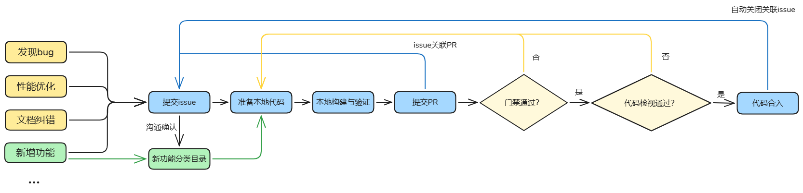

# 贡献指南

本项目欢迎广大开发者体验并参与贡献，在参与社区贡献之前。请参见[cann-community](https://gitcode.com/cann/community)了解行为准则，进行CLA协议签署，了解源码仓的贡献流程。

开发者准备本地代码与提交PR时需要重点关注如下几点：

1. 提交PR时，请按照PR模板仔细填写本次PR的业务背景、目的、方案等信息。
2. 若您的修改不是简单的bug修复，而是涉及到新增特性、新增接口、新增配置参数或者修改代码流程等，请务必先通过Issue进行方案讨论，以避免您的代码被拒绝合入。若您不确定本次修改是否可被归为“简单的bug修复”，亦可通过提交Issue进行方案讨论。


开发者贡献场景主要包括：

- 功能Bug修复

  如果您在本项目中发现了某些功能Bug，希望对其进行修复，欢迎您新建Issue进行反馈和跟踪处理。

  您可以按照[提交Issue/处理Issue任务](https://gitcode.com/cann/community#提交Issue处理Issue任务)指引新建 `Bug-Report|缺陷反馈` 类Issue对Bug进行描述，然后在评论框中输入“/assign”或“/assign @yourself”，将该Issue分配给您进行处理。
  
- 功能优化

  如果您对本项目中某些功能或接口实现有泛化性增强/性能优化思路，希望着手实现这些优化点，欢迎您对此进行优化贡献。

  您可以按照[提交Issue/处理Issue任务](https://gitcode.com/cann/community#提交Issue处理Issue任务)指引新建 `Requirement|需求建议` 类Issue对优化点进行说明，并提供您的设计方案，
  然后在评论框中输入“/assign”或“/assign @yourself”，将该Issue分配给您进行跟踪优化。

- 贡献新API

  如果您发现当前项目尚未支持的API，并想对尚未支持的API进行开发实现，欢迎您在Issue中提出新的想法和设计。

  您可以按照[提交Issue/处理Issue任务](https://gitcode.com/cann/community#提交Issue处理Issue任务)指引新建 `Requirement|需求建议` 类Issue提供新增API说明和设计方案，项目成员会与您进行沟通确认，并为您的API提供一个合适的`contrib`目录分类，您可以将新增API贡献到对应目录下。

  同时，您需要在提交的Issue中评论“/assign”或“/assign @yourself”，认领该Issue并在后续完成新增API上库。

- 文档纠错

  如果您在本项目中发现某些API文档描述错误，欢迎您新建Issue进行反馈和修复。

  您可以按照[提交Issue/处理Issue任务](https://gitcode.com/cann/community#提交Issue处理Issue任务)指引新建 `Documentation|文档反馈` 类Issue指出对应文档的问题，然后在评论框中输入“/assign”或“/assign @yourself”，将该Issue分配给您纠正对应文档描述。
  
- 帮助解决他人Issue

  如果社区中他人遇到的问题您有合适的解决方法，欢迎您在Issue中发表评论交流，帮助他人解决问题和痛点，共同优化易用性。

  如果对应Issue需要进行代码修改，您可以在Issue评论框中输入“/assign”或“/assign @yourself”，将该Issue分配给您，跟踪协助解决问题。

  ## 了解行为准则
  SHMEM属于CANN开放项目，在参与贡献前，请了解[CANN开放项目行为准则](https://gitcode.com/cann/community/blob/master/contributor/code-of-conduct.md)，后续您在SHMEM项目的活动（包括但不限于发表评论、提交Issue、发表wiki等）都请遵循此行为准则。
  
  ## 签署CLA
  
  在参与项目贡献前，您需要签署CANN开放项目贡献者许可协议（CLA）。
  
  请根据您的参与身份，选择签署法人CLA、法人贡献者CLA、个人CLA 或企业管理员CLA，请点击[这里](https://clasign.osinfra.cn/sign/68cbd4a3dbabc050b436cdd4)签署。
  
  - 法人CLA：以企业身份参与贡献，代表企业签署CLA，一般由企业管理人员进行签署。
  - 法人贡献者CLA：如果您属于签署了法人CLA的企业员工，请申请签署法人贡献者CLA，在申请页面选择您所属的企业，申请后将由企业管理员进行审批，审批完成即可参与贡献。
  - 个人CLA：以非企业员工的个人身份参与贡献，请签署个人CLA。
  - 企业管理员：以企业管理员的身份参与贡献，请签署企业管理员CLA，企业管理员有权对签署法人贡献者CLA的申请进行审批和人员管理。
  
  
  ## 参与贡献
  
  在签署了CLA协议之后，就可以开始您的贡献之旅啦！贡献的方式有很多种，每一种贡献都将受到欢迎和重视。
  
  所有您发现的问题或想贡献的新想法都可以通过[Issue](#提交Issue处理Issue任务)进行反馈、讨论和跟踪，并在后续[贡献编码](#贡献编码) PR 合入后关闭关联Issue。
  
  > 📝 **提示**
  >
  > - 关于Gitcode工作流的详细操作可参见[Gitcode工作流说明](https://gitcode.com/cann/community/blob/master/contributor/gitcode-workflow.md)。
  > - 当您在提交PR过程中遇到问题，常见问题的解决方法可参见[FAQs](https://gitcode.com/cann/infrastructure/blob/main/docs/FAQ/infra-faqs.md)。
  
  ### 贡献分类
  
  - bug修复
     
    如果您在本仓库中发现了某些算子Bug，并想对其进行修复，欢迎您在仓库中新建Issue进行反馈和跟踪处理。
  
    您可以按照下方[提交Issue/处理Issue任务](#提交Issue处理Issue任务)指引新建 `Bug-Report|缺陷反馈` 类Issue对Bug进行描述，
    然后在评论框中输入“/assign”或“/assign @yourself”将该Issue分配给您进行处理。
  
  - 性能优化
     
    如果您对本仓库中某些功能实现有泛化性增强/性能优化思路，并想着手实现这些优化点，欢迎您进行优化贡献。
  
    您可以按照下方[提交Issue/处理Issue任务](#提交Issue处理Issue任务)指引新建 `Requirement|需求建议` 类Issue对优化点进行说明，并提供您的设计方案，
    然后在评论框中输入“/assign”或“/assign @yourself”将该Issue分配给您进行跟踪优化。
  
  - 贡献新功能
     
    如果您有全新的算子想基于昇腾芯片进行设计实现，欢迎您在Issue中提出新的想法和设计，并与昇腾团队成员进行交流讨论。
  
    您可以按照下方[提交Issue/处理Issue任务](#提交Issue处理Issue任务)指引新建 `Requirement|需求建议` 类Issue提供您的新功能说明和设计方案，
    昇腾团队成员会与您进行沟通确认，并为您的功能提供一个合适的`contrib`目录分类，您可以将您的新功能贡献到对应分类目录下。
  
    同时，您需要在提交的Issue中评论“/assign”或“/assign @yourself”，认领该Issue并在后续完成新功能上库。
  
  - 文档纠错
     
    如果您在仓库中发现某些文档描述错误，欢迎您在仓库中新建Issue进行反馈和修复。
  
    您可以按照下方[提交Issue/处理Issue任务](#提交Issue处理Issue任务)指引新建 `Documentation|文档反馈` 类Issue指出对应文档中的问题，
    然后在评论框中输入“/assign”或“/assign @yourself”将该Issue分配给您纠正对应文档描述。
  
  - 帮助解决他人Issue
     
    如果社区中他人遇到的问题您有合适的解决方法，欢迎您在Issue中发表评论交流，帮助他人解决问题和痛点，共同优化易用性。
  
    如果对应Issue需要进行代码修改，您可以在Issue评论框中输入“/assign”或“/assign @yourself”将该Issue分配给您，跟踪协助解决问题。
  
  ### 提交Issue/处理Issue任务
  
  - 找到Issue列表：
    
    在[SHMEM](https://gitcode.com/cann/shmem)项目Gitcode主页内，点击“Issues”，即可找到 Issue 列表。
  
  - 提交Issue
    
    如果您准备向社区上报Bug或者提交需求，或者为社区贡献自己的意见或建议，请提交Issue。
  
    提交Issue请参考 [Issue 提交指南](https://gitcode.com/cann/community/blob/master/contributor/issue-operation.md)。
  
  - 参与Issue讨论
  
    每个Issue下面都支持开发者们交流讨论，如果您感兴趣，可以在评论区中发表自己的意见。
  
  - 找到愿意处理的Issue
  
    如果您愿意处理其中的一个 Issue，可以将它分配给自己。只需要在评论框内输入“/assign”或 “/assign @yourself”，机器人就会将问题分配给您，您的名字将显示在负责人列表里。
  
  ### 贡献编码
  
  1. 准备CANN开发环境
    
     如果您想参与编码贡献，需要准备CANN开发环境，请参考[环境准备](./README.md#二、环境构建)。
  
  2. 了解SHMEM的开发注意事项
  
     1）请参考[安装指南](./README.md#CANN详细安装指南)，了解编码贡献的一些环境和工具要求。
  
     2）SHMEM软件编码遵循许可协议：CANN Open Software License Agreement Version 2.0，详细的协议说明请参见[LICENSE](./LICENSE)文件，如果您贡献代码到SHMEM源码仓，请遵循此协议。
     
       请在新建的cpp、cc、h等源码文件头部增加如下声明：
     
       ```
       /**
        * Copyright (c) [Name of the copyright owner]. 2025. All rights reserved.
        * This program is free software, you can redistribute it and/or modify it under the terms and conditions of
        * CANN Open Software License Agreement Version 2.0 (the "License").
        * Please refer to the License for details. You may not use this file except in compliance with the License.
        * THIS SOFTWARE IS PROVIDED ON AN "AS IS" BASIS, WITHOUT WARRANTIES OF ANY KIND, EITHER EXPRESS OR IMPLIED,
        * INCLUDING BUT NOT LIMITED TO NON-INFRINGEMENT, MERCHANTABILITY, OR FITNESS FOR A PARTICULAR PURPOSE.
        * See LICENSE in the root of the software repository for the full text of the License.
        */
       ```
       
       请在新建的py、sh等文件头部增加如下声明：
       
       ```
       # Copyright (c) [Name of the copyright owner]. 2025. All rights reserved.
       # This program is free software, you can redistribute it and/or modify it under the terms and conditions of
       # CANN Open Software License Agreement Version 2.0 (the "License").
       # Please refer to the License for details. You may not use this file except in compliance with the License.
       # THIS SOFTWARE IS PROVIDED ON AN "AS IS" BASIS, WITHOUT WARRANTIES OF ANY KIND, EITHER EXPRESS OR IMPLIED,
       # INCLUDING BUT NOT LIMITED TO NON-INFRINGEMENT, MERCHANTABILITY, OR FITNESS FOR A PARTICULAR PURPOSE.
       # See LICENSE in the root of the software repository for the full text of the License.
       # ================================================================================================================
       ```
  
      - 如果您仅代表个人贡献，并且您个人拥有贡献内容的版权，请将第一行中的 `[Name of the copyright owner]` 替换为您的署名。
      - 如果您代表您的雇主贡献，或者您的雇主拥有您贡献内容的版权，请将第一行中的 `[Name of the copyright owner]` 替换为您的雇主的名称。
        
        如果您对于贡献内容的版权归属存在任何疑问，请您咨询法律顾问或您雇主的法律团队。
        
      - 第一行中`2025`为您创建或修改该文件的年份，请根据实际时间修改。
  
  3. 代码下载与贡献流程
    
     (1) 进行代码开发前，请先将需要SHMEM仓库fork到个人仓，然后将个人仓下载到本地。并在本地分支进行代码修改。  
     (2) 代码验证满足贡献要求后，提交Pull-Request，将代码贡献到SHMEM，在[Pull-Request列表](https://gitcode.com/cann/shmem/pulls)，可以找到提交的Pull-Request。  
     (3) 在提交的Pull-Request的评论区，评论`compile`触发编译。  
     (4) 请注意查看门禁测试结果，若未通过，请根据问题提示进行本地代码修改；若通过，此PR会被分配给commiter检视，请关注commiter的检视意见。  
     (5) 当您的PR检视通过后，代码会合入SHMEM源码仓。
  