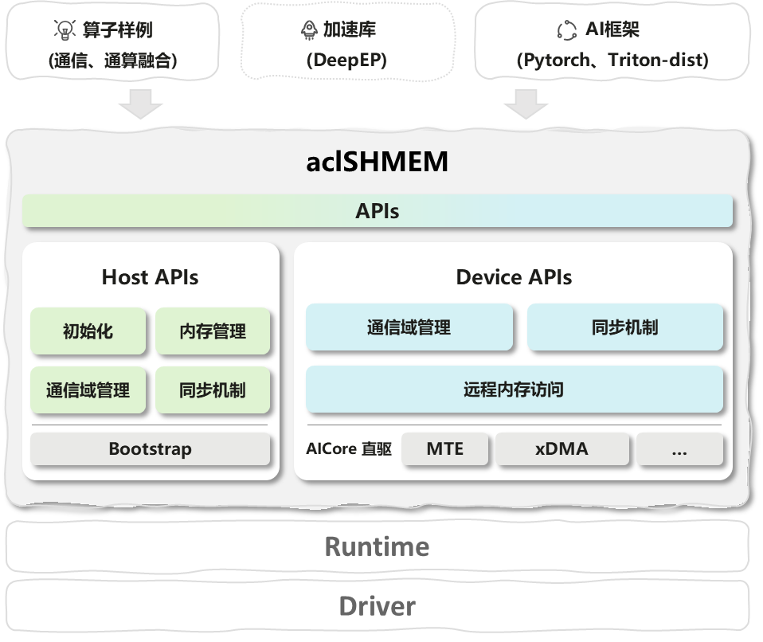

SHMEM
===
昇腾平台多机多卡内存访问加速库，为模型与算子开发者提供高效、易用的跨设备内存通信能力，简化卡间数据同步与通算融合算子开发流程。
# Latest News
🔥 [2025/12] SHMEM项目首次上线。

## 一、项目简介
SHMEM 是面向昇腾平台的多机多卡内存通信库，通过封装Host侧与Device侧接口，实现跨设备的高效内存访问与数据同步。其核心价值在于：
- 简化分布式场景下的卡间通信逻辑，降低算子开发门槛
- 集成MTE、xDMA等高性能通信引擎，提升多设备协同效率
- 与CANN生态深度适配，支持通算融合类算子的快速部署

## 二、核心功能


**1. 双侧接口体系**
- Host侧：负责初始化、内存堆管理、通信域（Team）创建及全局同步
- Device侧：提供远程内存访问（RMA）、设备级同步及通信域操作

   接口设计贴合昇腾算子开发范式，支持Host与Device协同工作流。

**2. 高性能通信优化**
- 内置MTE、xDMA引擎支持，实现远程内存直接读写，减少数据传输延迟
- 兼容MPI通信框架，支持集合通信（Allgather/Allreduce等）场景
- 针对昇腾硬件特性优化数据传输路径，提升多卡协同效率。

**3. 安全通信机制**
- 默认启用TLS加密保护跨设备数据传输，支持接口级关闭控制：
int32_t ret = shmem_set_conf_store_tls(false, NULL, 0);
- 提供安全加固指南，包括权限配置、加密套件选择等企业级安全策略。

**4. 昇腾生态适配**
- 支持Atlas 800I/A800T A2/A3系列硬件，兼容aarch64/x86架构
- 依赖CANN 8.1.RC1+环境，与Ascend处理器加速能力深度协同。

**5. 多语言与扩展支持**
- 提供C++原生接口与Python封装，满足不同开发场景需求
- 模块化设计支持通信后端（MTE/xDMA）动态切换，便于功能扩展。

**6. 丰富场景样例**

覆盖基础通信到复杂算子融合场景：
- rdma_demo：RDMA协议通信演示
- matmul_allreduce：通算融合算子实现（矩阵乘+Allreduce）。

## 三、环境依赖
### 硬件要求
- Atlas系列：800I A2/A3、800T A2/A3
- 架构兼容：aarch64、x86
### 软件依赖
- 驱动固件：Ascend HDK 25.0.RC1.1
- CANN版本（根据功能选择其一）：
    - 8.2.RC1.alpha003 及以上（社区版）支持 D2D 功能。下载链接：[社区版资源](https://www.hiascend.com/developer/download/community/result?module=cann)
    - 8.5.0 及以上（尝鲜版）支持 D2D、D2H、H2D 功能。下载链接：[尝鲜版链接](https://ascend.devcloud.huaweicloud.com/cann/run/software/)
- 工具链：
    - cmake ≥ 3.19
    - GLIBC ≥ 2.28

> Note：
> - D2D：device to device
> - D2H：device to host
> - H2D：host to device
### 可选依赖
- MPI：OpenMPI 4.0+（分布式通信场景）
- Python：3.7+（Python 接口使用）
- PyTorch：1.12+（Python 示例运行）

## 四、快速开始
### 环境准备
配置CANN环境变量（默认安装路径）：
```bash
source /usr/local/Ascend/ascend-toolkit/set_env.sh
```
### 安装方式
#### 方式一：源码编译
```bash
# 克隆代码仓
git clone https://gitcode.com/cann/shmem.git
cd shmem

# 编译核心库（默认包含示例和测试）
bash scripts/build.sh

# 配置环境变量
source install/set_env.sh
```
#### 方式二：二进制包安装
软件包格式：```SHMEM_{version}_linux-{arch}.run```
```bash
# 权限配置与校验
chmod +x SHMEM_1.0.0_linux-aarch64.run
./SHMEM_1.0.0_linux-aarch64.run --check

# 安装（默认路径：/usr/local/cann/shmem）
./SHMEM_1.0.0_linux-aarch64.run --install
```
### 验证安装
以```matmul_allreduce```为例，验证核心功能：
1. 编译依赖库
   ```bash
   cd 3rdparty && git clone https://gitee.com/ascend/catlass.git && cd ..
   ```
1. 编译并运行样例
   ```bash
   # 编译样例
   cd examples/matmul_allreduce && bash build.sh

   # 生成测试数据（M=1024, K=2048, N=8192）
   python3 utils/gen_data.py 1 2 1024 2048 8192 16 0 0

   # 启动2卡运行
   bash run.sh -ranks 2 -M 1024 -K 2048 -N 8192
   ```
1. 精度验证
   ```bash
   python3 utils/verify_result.py ./out/output.bin ./out/golden.bin 1 1024 8192 16
   ```
### Python接口使用
1. 编译时启用Python扩展
   ```bash
   bash scripts/build.sh -python_extension
   ```
1. 安装wheel包
   ```bash
   cd src/python && python3 setup.py bdist_wheel
   pip3 install dist/shmem-1.0.0-cp39-cp39-linux_aarch64.whl
   ```
1. 测试运行
   ```bash
   # 关闭TLS加密（可选）
   export SHMEM_TLS_DISABLE=1

   # 多进程测试（2个rank）
   torchrun --nprocs-per-node=2 test_shmem.py
   ```
## 五、典型使用场景
**1. 通算融合类算子开发**

基于 Device 侧内存直接访问接口，开发融合「计算+通信」的自定义算子（如 matmul+allreduce），减少卡间数据拷贝，提升算子执行效率。

**2. 多机多卡数据同步**

通过 Host 侧通信域管理接口，快速搭建多机多卡集群的内存共享通道，实现跨节点数据同步，适配分布式训练场景。

**3. 低延迟卡间通信**

利用 RDMA 优化的 Device 侧接口，实现卡间毫秒级数据传输，满足实时性要求高的 AI 推理场景。

**4. Python 分布式训练适配**

通过 Python 扩展接口，将 SHMEM 集成到 PyTorch 分布式训练流程中，替代传统 MPI 通信，降低训练通信开销。

## 六、代码结构
### 核心目录说明
```
shmem/                                        # 项目根目录
├── docs/                                     # 文档与说明
├── examples/                                 # 示例工程集合
├── include/                                  # 对外头文件
│   ├── device/                               # device侧头文件
│   │   ├── gm2gm/                            # device侧aicore驱动gm2gm数据面高阶和低阶接口
│   │   │   └── engine/                       # aicore 直驱gm2gm 低阶接口
│   │   ├── team/                             # device侧通信域管理
│   │   └── ub2gm/                            # device侧aicore驱动ub2gm数据面低阶接口
│   │       └── engine/                       # aicore 直驱ub2gm 低阶接口
│   ├── host/                                 # host侧头文件
│   │   ├── data_plane/                       # host侧CPU驱动数据面接口
│   │   ├── init/                             # host侧初始化接口
│   │   ├── mem/                              # host侧内存管理接口
│   │   ├── team/                             # host侧通信域管理接口
│   │   └── utils/                            # 工具与通用辅助代码
│   ├── host_device/                          # 共用目录
│   └── shmem.h                               # shmem所有对外API汇总
├── src/                                      # 源码实现
│   ├── device/                               # device侧实现
│   │   ├── gm2gm/                            # device侧aicore驱动gm2gm数据面高阶和低阶接口
│   │   │   └── engine/                       # aicore 直驱gm2gm 低阶接口
│   │   ├── team/                             # device侧通信域管理
│   │   └── ub2gm/                            # device侧aicore驱动ub2gm数据面低阶接口
│   │       └── mte/                          # aicore 直驱ub2gm 低阶接口
│   ├── host/                                 # host侧实现
│   │   ├── bootstrap/                        # bootstrap
│   │   ├── hybm/                             # Hybrid Memory（hybm）实现
│   │   ├── init/                             # 初始化
│   │   ├── mem/                              # 内存管理相关
│   │   ├── python_wrapper/                   # Python 封装/绑定
│   │   ├── sync/                             # 同步原语（barrier/p2p/order）
│   │   ├── team/                             # team（通信域）相关
│   │   ├── transport/                        # 传输层实现（如 RDMA）
│   │   └── utils/                            # 工具与通用辅助代码
│   ├── host_device/                          # 共用目录
│   └── python/                               # python相关目录
├── tests/                                    # 测试用例集合（UT/功能测试）
│   ├── examples/                             # 示例工程集合
│   └── unittest/                             # 单元测试模块（UT）
│       ├── device/                           # Device 侧 UT
│       │   ├── mem/                          # 内存管理相关
│       │   ├── sync/                         # 同步原语（barrier/p2p/order）
│       │   └── team/                         # team（通信域）相关
│       ├── host/                             # Host 侧 UT
│       │   ├── init/                         # 初始化
│       │   ├── mem/                          # 内存管理相关
│       │   ├── sync/                         # 同步原语（barrier/p2p/order）
│       │   └── team/                         # team（通信域）相关
│       ├── include/                          # 头文件
│       └── team/                             # team（通信域）相关
└── scripts/                                  # 示例脚本（编译/运行）

```
## 七、配置与调优（可选，进阶使用）
**1. 关闭 TLS 加密（提升通信性能）**

默认开启 TLS 加密，若为内网可信环境，可关闭以提升通信速度：
```c
// C/C++ 接口
int32_t ret = shmem_set_conf_store_tls(false, null, 0);

# Python 接口
import shmem as shm
shm.set_conf_store_tls(False, "")
```
**2. 调整共享内存大小**

初始化时指定共享内存池大小（默认 16GB），适配大内存场景：
```c
shmem_attr_t attr;
attr.mem_size = 32 * 1024 * 1024 * 1024; // 32GB
shmem_init_with_attr(&attr);
```
**3. 性能调优建议**

- 优先使用 Device 侧接口（减少 Host-Device 交互）；
- 通信域分组时，按物理机节点划分，减少跨节点通信；
- 大批次数据传输时，开启 RDMA 协议（编译时加 -DSHMEM_RDMA=ON）。
## 八、常见问题（FAQ）
### Q1：编译时报「CANN 环境未找到」？
A：确认已执行 ```source /usr/local/Ascend/ascend-toolkit/set_env.sh```，且 CANN 版本满足[软件依赖](#软件依赖)。
### Q2：运行示例时报「卡间通信超时」？
A：检查网卡是否开启 RDMA、防火墙是否放行通信端口（默认 8666）、各节点时钟是否同步。
### Q3：Python 导入 shmem 时报「找不到模块」？
A：确认已安装 wheel 包，且 ```source``` 了 install 目录下的 ```set_env.sh```，环境变量 ```PYTHONPATH``` 包含 shmem 路径。
### Q4：关闭 TLS 后仍提示加密失败？
A：需在 ```shmem_init()``` 前调用 ```shmem_set_conf_store_tls()```，初始化后无法修改 TLS 配置。
> 更多故障排查见：[Troubleshooting](docs/Troubleshooting_FAQs.md)
## 九、测试框架
- **单元测试：** 覆盖核心接口（初始化、内存操作、同步等），位于tests/unittest/
- **算子泛化性测试：** 针对matmul_allreduce等样例，支持动态生成测试数据与精度校验
### 1. 运行单元测试
```bash
# 编译并运行单元测试
bash scripts/build.sh -uttests
cd tests/unittest && ./shmem_unittest
```
### 2. 运行 Python 测试用例
```bash
# 编译 Python 扩展
bash build.sh -python_extension
# 安装 wheel 包
pip3 install src/python/dist/shmem-xxx.whl --force-reinstall
# 2卡运行 Python 测试
torchrun --nproc-per-node=2 src/python/test.py
```
### 3. 自定义测试
基于 ```tests/``` 目录的 gtest 框架，新增测试用例需遵循：
- 测试文件命名：```{module}_test.cc```
- 测试用例命名：```{FunctionName}_{Scenario}_Test```
## 十、贡献指南
我们欢迎所有形式的贡献（代码、文档、bug反馈）：
### 1. 提 Issue
- 提交 bug：明确环境（硬件/软件版本）、复现步骤、错误日志；
- 提功能需求：说明场景、预期效果、适配的硬件/软件版本。
### 2. 提 PR
- 分支规范：功能开发用 ```feature/xxx```，bug 修复用 ```bugfix/xxx```；
- 代码规范：遵循 代码风格文档，新增代码需补充单元测试；
- PR 描述：说明修改目的、核心逻辑、测试验证结果。
### 3. 代码审核
- PR 需通过 CI 自动测试（编译、单元测试、代码规范检查）；
- 至少 1 名维护者审核通过后，方可合并。
## 十一、安全声明
- 通信安全：默认启用TLS加密，支持自定义加密套件
- 公网依赖：依赖的开源仓库与工具地址参见[公网地址清单](SECURITY.md#公网地址声明)
- 加固指南：参考[安全加固建议](SECURITY.md#安全加固)配置系统权限与防火墙
## 十二、版权与许可
Copyright (c) 2025 Huawei Technologies Co., Ltd.
本项目基于CANN Open Software License Agreement Version 2.0授权，仅允许用于昇腾处理器相关开发。
## 十三、注意事项
1. 本项目仅适配昇腾平台，不支持其他硬件架构（如 x86 通用服务器、NVIDIA GPU）；
2. 示例代码仅供学习参考，生产环境使用前需完成充分的功能和性能测试；
3. CANN 版本升级可能导致接口兼容问题，建议锁定文档指定的 CANN 版本；
4. 关闭 TLS 加密后，需确保通信网络为可信内网，避免数据泄露风险。
