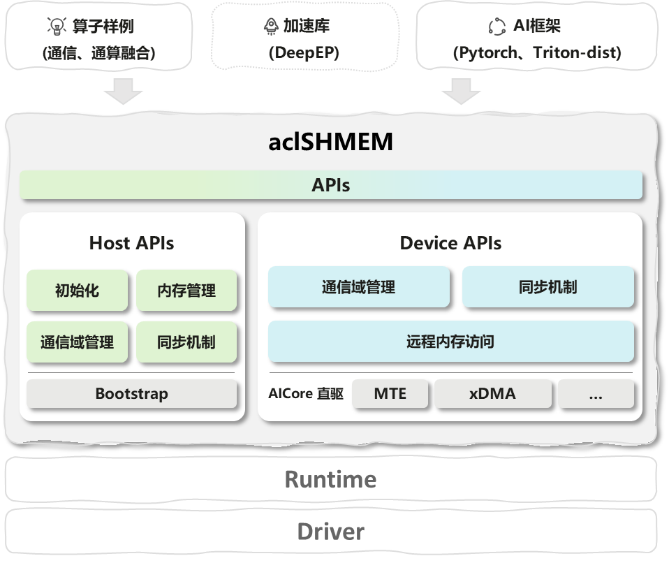

<div align="center">

# SHMEM

<h4>基于对称内存的昇腾分布式内存通信加速库</h4>

[](https://shmem-doc.pages.dev/)
[](https://gitcode.com/cann/shmem/releases/v1.3.0)
[](https://www.hiascend.com/)
[](https://gitcode.com/cann/community/tree/master/CANN/sigs/shmem)

</div>

## 最新动态
🚀 [2026/04] [SHMEM v1.3.0](https://gitcode.com/cann/shmem/releases/v1.3.0) 版本发布，欢迎下载体验。
   - 新增 AICore 直驱能力： 910B/C SDMA 访存和预取，950 MTE 访存，覆盖更多通信引擎。
   - 新增 40+ 接口，覆盖 RMA、Signal、P2P 同步、Barrier 等，完善通信编程语义。
   - 增强 log、sanitizer、profiling、debug 等 DFX 能力，提升问题定位效率。

🔥 [2025/12] SHMEM 项目首次上线。

## ⚡️快速入门
若您希望快速体验项目，请访问[快速入门](docs/quickstart.md)获取简易教程，包括环境搭建、编译执行、本地验证等操作。

若您需要了解文档和接口中出现的缩写与名词，请参考[术语表](docs/glossary.md)。

## 一、项目简介
SHMEM 是面向昇腾平台的多机多卡内存通信库，通过封装 Host 侧与 Device 侧接口，实现跨设备的高效内存访问与数据同步。其核心价值在于：
- 支持 AICore 直驱 MTE、xDMA 使能 D2D/D2H/H2D/D2rH/rH2D 通信
- 简化分布式场景下的卡间通信逻辑，降低算子开发门槛
- 与 CANN 生态深度适配，支持通算融合类算子的快速部署
- 更多详细资料请参考[SHMEM](https://shmem-doc.pages.dev/)


## 二、核心功能


**1. 双侧接口体系**
- Host 侧：负责初始化、内存堆管理、通信域（Team）创建及全局同步
- Device 侧：提供远程内存访问（RMA）、设备级同步及通信域操作

接口设计贴合昇腾算子开发范式，支持 Host 与 Device 协同工作流。

**2. 高性能通信优化**
- 内置 MTE、xDMA 引擎支持，实现远程内存直接读写，减少数据传输延迟
- 兼容 MPI 通信框架，支持集合通信（Allgather/Allreduce 等）场景
- 针对昇腾硬件特性优化数据传输路径，提升多卡协同效率

**3. 安全通信机制**
- 默认启用 TLS 加密保护跨设备数据传输，支持接口级关闭控制：
   ```c
   int32_t ret = aclshmemx_set_conf_store_tls(false, NULL, 0);
   ```

- 提供安全加固指南，包括权限配置、加密套件选择等企业级安全策略

**4. 通信通路覆盖**

下图展示了 SHMEM 支持的全链路通信通路（以910A3为例），覆盖 Host 侧与 Device 侧的不同传输引擎：


如图所示，SHMEM 支持多种通信引擎和通路：
- **MTE Engine**：芯片级内存传输引擎，支持 D2D、D2H、H2D、D2rH、rH2D 多种通路
- **xDMA Engine**：高速直接内存访问引擎，支撑主机内/主机间高效数据传输

**5. 多语言与扩展支持**
- 提供 C++ 原生接口与 Python 封装，满足不同开发场景需求
- 模块化设计支持通信后端（MTE/xDMA）动态切换，便于功能扩展

**6. 丰富场景样例**
覆盖基础通信到复杂算子融合场景：
- rdma_demo：RDMA 协议通信演示
- matmul_allreduce：通算融合算子实现（矩阵乘 + Allreduce）


## 三、代码结构
```
shmem/                                  # 项目根目录
├── docs/                               # 文档与说明
├── examples/                           # 示例工程集合
├── include/                            # 对外头文件
│   ├── shmem.h                         # SHMEM 所有对外 API 汇总
│   ├── device/                         # Device 侧头文件
│   │   ├── gm2gm/                      # AICore 驱动 gm2gm 数据面接口
│   │   │   └── engine/                 # AICore 直驱 gm2gm 低阶接口
│   │   ├── team/                       # Device 侧通信域管理
│   │   └── ub2gm/                      # AICore 驱动 ub2gm 数据面接口
│   │       └── engine/                 # AICore 直驱 ub2gm 低阶接口
│   ├── host/                           # Host 侧头文件
│   │   ├── data_plane/                 # Host 侧数据面接口
│   │   ├── init/                       # Host 侧初始化接口
│   │   ├── mem/                        # Host 侧内存管理接口
│   │   ├── team/                       # Host 侧通信域管理接口
│   │   └── utils/                      # 工具与通用辅助代码
│   └── host_device/                    # 共用目录
├── scripts/                            # 示例脚本（编译/运行）
├── src/                                # 源码实现
│   ├── device/                         # Device 侧实现
│   │   ├── gm2gm/                      # AICore 直驱 gm2gm 数据面接口
│   │   │   └── engine/                 # AICore 直驱 gm2gm 低阶接口
│   │   ├── team/                       # Device 侧通信域管理
│   │   └── ub2gm/                      # AICore 驱动 ub2gm 数据面接口
│   │       └── mte/                    # AICore 直驱 ub2gm 低阶接口
│   ├── host/                           # Host 侧实现
│   │   ├── bootstrap/                  # bootstrap
│   │   ├── hybm/                       # Hybrid Memory 实现
│   │   ├── init/                       # 初始化
│   │   ├── mem/                        # 内存管理相关
│   │   ├── python_wrapper/             # Python 封装/绑定
│   │   ├── sync/                       # 同步原语（barrier/p2p/order）
│   │   ├── team/                       # team（通信域）相关
│   │   ├── transport/                  # 传输层实现（如 RDMA\SDMA\UDMA）
│   │   └── utils/                      # 工具与通用辅助代码
│   ├── host_device/                    # 共用目录
│   └── python/                         # Python 相关目录
└── tests/                              # 测试用例集合（UT/功能测试）
```

## 四、典型使用场景
**1. 通算融合类算子开发**：基于 Device 侧内存直接访问接口，开发融合「计算+通信」的自定义算子（如 matmul+allreduce），减少卡间数据拷贝，提升算子执行效率。

**2. 多机多卡数据同步**：通过 Host 侧通信域管理接口，快速搭建多机多卡集群的内存共享通道，实现跨节点数据同步，适配分布式训练场景。

**3. 低延迟卡间通信**：利用 RDMA 优化的 Device 侧接口，实现卡间毫秒级数据传输，满足实时性要求高的 AI 推理场景。

**4. Python 分布式训练适配**：通过 Python 扩展接口，将 SHMEM 集成到 PyTorch 分布式训练流程中，替代传统 MPI 通信，降低训练通信开销。


## 五、常见问题（FAQ）
**Q1：编译时报「CANN 环境未找到」？**

A：确认已执行 `source /usr/local/Ascend/ascend-toolkit/set_env.sh`，且 CANN 版本满足 [CANN 版本说明](docs/quickstart.md#43-cann)。

**Q2：运行示例时报「卡间通信超时」？**

A：检查网卡是否开启 RDMA、防火墙是否放行通信端口（默认 8666）、各节点时钟是否同步。

**Q3：Python 导入 shmem 时报「找不到模块」？**

A：确认已安装 wheel 包，且 `source` 了 install 目录下的 `set_env.sh`，环境变量 `PYTHONPATH` 包含 shmem 路径。

**Q4：关闭 TLS 后仍提示加密失败？**

A：需在 `aclshmemx_init_attr` 前调用 `aclshmemx_set_conf_store_tls`，初始化后无法修改 TLS 配置。

**Q5：googletest、catlass 这两个插件执行 `build.sh` 时提示 git 失败？**

A：确认 git 配置是否可以访问网站，如果环境不能连接网站可以尝试手动下载文件到 3rdparty 目录下。

**Q6：CANN 包安装失败怎么办？**

A：查看[常见问题](https://www.hiascend.com/document/detail/zh/AscendFAQ/CommuFunc/resdl/rdl_011.html)

> 更多故障排查见：[Troubleshooting](docs/debug/Troubleshooting_FAQs.md)

## 六、贡献
### 贡献者列表
- [华南理工大学 陆璐教授团队](https://www2.scut.edu.cn/cs/2017/0629/c22284a328108/page.htm)

### 参与贡献指南
欢迎订阅 [SHMEM SIG 会议](https://mailweb.cann.osinfra.cn/mailman3/lists/shmem.cann.osinfra.cn/)，参与社区例会和议题讨论，与社区成员共同交流方案设计、接口规划和使用问题。

**1. 提 Issue**

- 提交 bug：明确环境（硬件/软件版本）、复现步骤、错误日志；
- 提功能需求：说明场景、预期效果、适配的硬件/软件版本。

**2. 提 PR**

- 分支规范：功能开发用 `feature/xxx`，bug 修复用 `bugfix/xxx`；
- 代码规范：遵循项目代码规范，新增代码需补充单元测试；
- PR 描述：说明修改目的、核心逻辑、测试验证结果。

**3. 代码审核**

- PR 需通过 CI 自动测试（编译、单元测试、代码规范检查）；
- 至少 1 名维护者审核通过后，方可合并。

详细步骤可参考[贡献指南](CONTRIBUTING.md)

## 七、安全声明
- 通信安全：默认启用 TLS 加密，支持自定义加密套件
- 公网依赖：依赖的开源仓库与工具地址参见[公网地址清单](SECURITY.md#公网地址声明)
- 加固指南：参考[安全加固建议](SECURITY.md#安全加固)配置系统权限与防火墙

## 八、版权与许可
Copyright (c) 2025 Huawei Technologies Co., Ltd.
本项目基于 CANN Open Software License Agreement Version 2.0 授权，仅允许用于昇腾处理器相关开发。

## 九、注意事项
1. 本项目仅适配昇腾平台，不支持其他硬件架构（如 x86 通用服务器、NVIDIA GPU）；
2. 示例代码仅供学习参考，生产环境使用前需完成充分的功能和性能测试；
3. CANN 版本升级可能导致接口兼容问题，建议锁定文档指定的 CANN 版本；
4. 关闭 TLS 加密后，需确保通信网络为可信内网，避免数据泄露风险。
