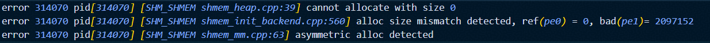
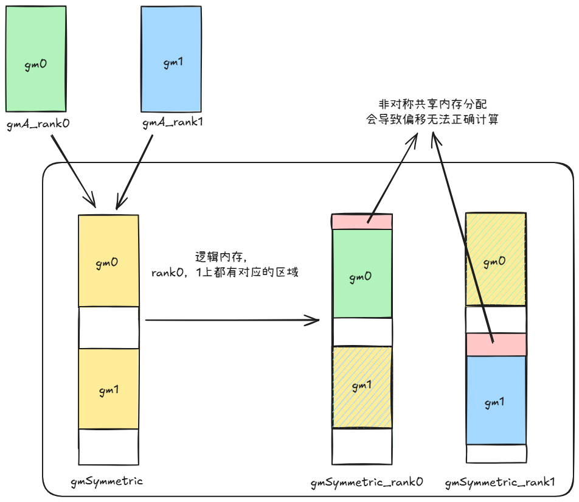
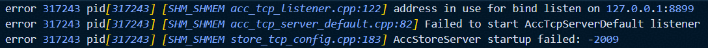
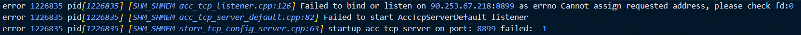
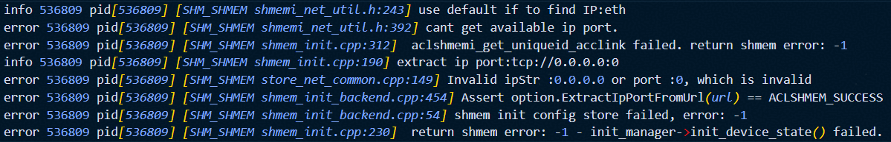

# SHMEM 使用限制
1. GM2GM的highlevel RMA操作使用默认buffer，不支持并发操作，否则可能造成数据覆盖。若有并发需求，建议使用lowlevel接口。
2. barrier接口当前必须在Mix Kernel（包含mmad和GM2UB/UB2GM操作）中使用，可参考example样例。该限制待编译器更新后移除。
3. 使用RDMA的高阶接口前，需要先使用`aclshmemx_rdma_config`接口配置UB Buffer和sync_id等信息。若不配置，则使用默认的190KB处的UB Buffer和EVENT_ID0作为接口内部的同步EVENT_ID。RDMA相关接口内部使用`PipeBarrier<PIPE_MTE3>`阻塞MTE3流水以确保RDMA任务下发完成。

# SHMEM 常见问题
## 内存分配相关问题
### aclshmem_malloc多卡分配非对称共享内存

#### Q: 算子精度问题，无error日志，发现共享内存访问到的数据异常;


错误示例代码: 

以`example`目录下的`allgather_matmul`为例，以下为非对称共享内存分配分配的简单示例场景：

```cpp
// Inappropriate calling of aclshmem_malloc
void *symmTest = nullptr;
symmTest = aclshmem_malloc(((rank_id + 1) * 1024 * 1024) * sizeof(__fp16));

void *symmPtr = aclshmem_malloc((204 * 1024 * 1024) * sizeof(__fp16));
uint8_t *gmSymmetric = (uint8_t *)symmPtr;

... ...

aclshmem_free(symmPtr);
if (symmTest != nullptr) {
    aclshmem_free(symmTest);
}
```

#### A: 可使用debug模式排查共享内存分配对称性问题

`debug`模式开启方法：在代码仓根目录下执行：`bash scripts/build.sh -examples -debug`

此时执行代码获得如下报错，确认错误为使用`aclshmem_malloc`接口分配了非对称的共享内存



错误原因分析示意图:

修正方式: 确保每个rank分配相同大小的共享内存



### aclshmemx_set_attr_uniqueid_args对每个pe设置了不同的local_mem_size
#### Q: 提示local size diffs

错误调用代码片段:

```cpp
aclshmemx_init_attr_t attributes;
aclshmemx_uniqueid_t uid = ACLSHMEM_UNIQUEID_INITIALIZER;

int64_t local_mem_size = (1024 + pe * 2) * 1024 * 1024;
if (pe == 0) {
    status = aclshmemx_get_uniqueid(&uid);
}

MPI_Bcast(&uid, sizeof(aclshmemx_uniqueid_t), MPI_UINT8_T, 0, MPI_COMM_WORLD);
status = aclshmemx_set_attr_uniqueid_args(pe, pe_size, 
                                            local_mem_size, 
                                            &uid, &attributes);
status = aclshmemx_init_attr(ACLSHMEMX_INIT_WITH_UNIQUEID, &attributes);
```

错误日志:


注意: 
1. 日志中显示的实际分配大小和local_mem_size大小有`6MB`的差异为shmem框架内部使用空间
2. 此处`local_mem_size`大小为`2MB`对齐，若尝试分配其他大小如`1025 * 1024 * 1024`可能会出现不同的错误信息: 


#### A: 应保证aclshmemx_init_attr_t初始化过程中每pe分配的local_mem_size大小一致

## IP/PORT配置相关问题
### 绑定端口被占用
#### Q: 尝试使用的ip/port已被占用，错误日志如图:
1. 端口被占用错误日志: 



2. ip不可用错误日志1: 



3. ip不可用错误日志2: 


#### A: 逐步排查ip及端口可用情况
1. 确认ip是否符合预期
2. 检查端口是否被占用，`netstat -tuln | grep <端口号>`
3. 调整环境变量`SHMEM_UID_SESSION_ID`及实际执行文件所使用的ip及端口号

### 未通过环境变量配置ip/port，使用默认eth查询ip信息失败
#### Q: `SHMEM_UID_SESSION_ID`和`SHMEM_UID_SOCK_IFNAM`均未配置时使用`eth:inet4`查询本地ip地址，查询失败时错误日志如下: 



#### A: 应手动配置`SHMEM_UID_SESSION_ID`或`SHMEM_UID_SOCK_IFNAM`
配置示例:
- SHMEM_UID_SESSION_ID: 

    `SHMEM_UID_SESSION_ID=127.0.0.1:1234`
- SHMEM_UID_SOCK_IFNAM: 

    `SHMEM_UID_SOCK_IFNAM=[6666:6666:6666:6666:6666:6666:6666:6666]:886`
    
    `SHMEM_UID_SOCK_IFNAM=enpxxxx:inet4` 取ipv4

    `SHMEM_UID_SOCK_IFNAM=enpxxxx:inet6` 取ipv6

注意: 同时配置时只读取`SHMEM_UID_SESSION_ID`