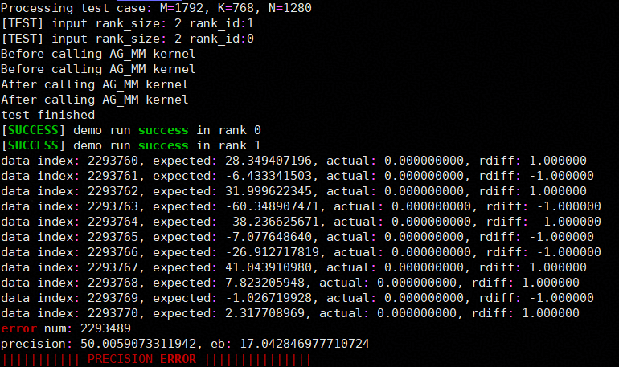
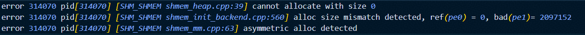
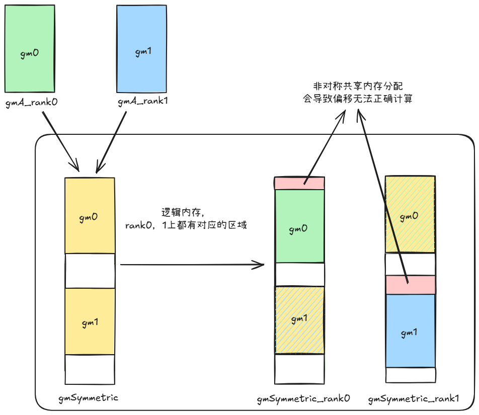
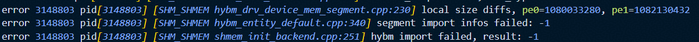
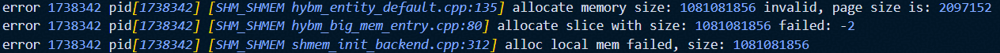
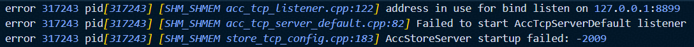
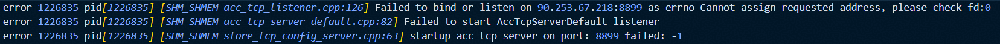
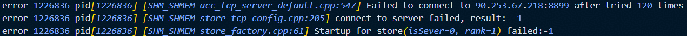
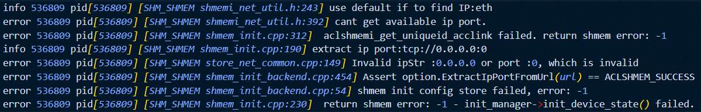

# SHMEM 使用限制
1. GM2GM的highlevel RMA操作使用默认buffer，不支持并发操作，否则可能造成数据覆盖。若有并发需求，建议使用lowlevel接口。
2. barrier接口当前必须在Mix Kernel（包含mmad和GM2UB/UB2GM操作）中使用，可参考example样例。该限制待编译器更新后移除。
3. 使用RDMA的高阶接口前，需要先使用`aclshmemx_rdma_config`接口配置UB Buffer和sync_id等信息。若不配置，则使用默认的190KB处的UB Buffer和EVENT_ID0作为接口内部的同步EVENT_ID。RDMA相关接口内部使用`PipeBarrier<PIPE_MTE3>`阻塞MTE3流水以确保RDMA任务下发完成。
4. 使用SDMA的高阶接口前，需要先使用`aclshmemx_sdma_config`接口配置UB Buffer和sync_id等信息，且需要保证预留UB Buffer大小大于等于64字节。若不配置，则使用默认的191KB处的UB Buffer和EVENT_ID0作为接口内部的同步EVENT_ID。
5. 910B 16卡机型：NPU分为前八卡后八卡两个8P Fullmesh组，每个8P组内通过HCCS总线完成两两互联，两个8P Fullmesh组之间通过PCIe-SW完成互连，因此不支持直接使用MTE接口在跨组NPU间完成数据搬运。部分example用例使用MTE搬运接口，单机用例请勿跨组指定NPU，以防发生未知报错（如流同步失败等）。
6. 910C D2H/D2rH等功能，需要确保Host内存（DRAM）可用空间大于aclshmemx_init_attr_t初始化过程中pe分配的local_mem_size大小。因为HCCS总线上DRAM地址范围是固定的，部分环境上并不是所有DRAM都在HCCS固定的总线地址范围内，只有和HCCS总线固定的地址交集部分才是可用的DRAM空间。确认DRAM可用空间方法：通过lsmem查询本机物理地址范围，和如下4个地址区间取交集（0x29580000000-0x34000000000， 0xa9580000000-0xb4000000000， 0x129580000000-0x134000000000， 0x1a9580000000-0x1b4000000000），得到具体可用的DRAM容量。如果没有交集，表示当前没有可用DRAM空间或可用空间小于配置的local_mem_size，则不支持该功能。

# SHMEM 常见问题
## 内存分配相关问题
### aclshmem_malloc多卡分配非对称共享内存

#### Q: 算子精度问题，无error日志，发现共享内存访问到的数据异常;



错误示例代码: 

以`example`目录下的`allgather_matmul`为例，以下为非对称共享内存分配的简单示例场景：

```cpp
// Inappropriate calling of aclshmem_malloc
void *symmTest = nullptr;
symmTest = aclshmem_malloc(((rank_id + 1) * 1024 * 1024) * sizeof(__fp16));

void *symmPtr = aclshmem_malloc((204 * 1024 * 1024) * sizeof(__fp16));
uint8_t *gmSymmetric = (uint8_t *)symmPtr;

... ...

aclshmem_free(symmPtr);
if (symmTest != nullptr) {
    aclshmem_free(symmTest);
}
```

#### A: 可使用debug模式排查共享内存分配对称性问题

`debug`模式开启方法：在代码仓根目录下执行：`bash scripts/build.sh -examples -debug`

此时执行代码获得如下报错，确认错误为使用`aclshmem_malloc`接口分配了非对称的共享内存



错误原因分析示意图:

修正方式: 确保每个rank分配相同大小的共享内存



### aclshmemx_set_attr_uniqueid_args对每个pe设置了不同的local_mem_size
#### Q: 提示local size diffs

错误调用代码片段:

```cpp
aclshmemx_init_attr_t attributes;
aclshmemx_uniqueid_t uid = ACLSHMEM_UNIQUEID_INITIALIZER;

int64_t local_mem_size = (1024 + pe * 2) * 1024 * 1024;
if (pe == 0) {
    status = aclshmemx_get_uniqueid(&uid);
}

MPI_Bcast(&uid, sizeof(aclshmemx_uniqueid_t), MPI_UINT8_T, 0, MPI_COMM_WORLD);
status = aclshmemx_set_attr_uniqueid_args(pe, pe_size, local_mem_size, &uid, &attributes);
status = aclshmemx_init_attr(ACLSHMEMX_INIT_WITH_UNIQUEID, &attributes);
```

错误日志:



注意: 
1. 日志中显示的实际分配大小和local_mem_size大小有`6MB`的差异为shmem框架内部使用空间
2. 此处`local_mem_size`大小为`2MB`对齐，若尝试分配其他大小如`1025 * 1024 * 1024`可能会出现不同的错误信息: 



#### A: 应保证aclshmemx_init_attr_t初始化过程中每pe分配的local_mem_size大小一致

## IP/PORT配置相关问题
### 绑定端口被占用
#### Q: 尝试使用的ip/port已被占用，错误日志如图:
1. 端口被占用错误日志: 



2. ip不可用错误日志1: 



3. ip不可用错误日志2: 




#### A: 逐步排查ip及端口可用情况
1. 确认ip是否符合预期
2. 检查端口是否被占用，`netstat -tuln | grep <端口号>`
3. 调整环境变量`SHMEM_UID_SESSION_ID`及实际执行文件所使用的ip及端口号

### 未通过环境变量配置ip/port，且使用自动搜索可用网口时失败
#### Q: `SHMEM_UID_SESSION_ID`和`SHMEM_UID_SOCK_IFNAME`均未配置时自动搜索可用网口（IPv4/IPv6均可，排除lo/docker/veth/br-/virbr/tun/tap等虚拟接口），查询失败时错误日志如下: 



#### A: 应手动配置可用的`SHMEM_UID_SESSION_ID`或`SHMEM_UID_SOCK_IFNAME`
配置示例:
- SHMEM_UID_SESSION_ID: 

    `SHMEM_UID_SESSION_ID=127.0.0.1:1234`

    `SHMEM_UID_SESSION_ID=localhost:8888`
- SHMEM_UID_SOCK_IFNAME: 

    `SHMEM_UID_SOCK_IFNAME=[6666:6666:6666:6666:6666:6666:6666:6666]:886`

    `SHMEM_UID_SOCK_IFNAME=enpxxxx:inet4` 取ipv4

    `SHMEM_UID_SOCK_IFNAME=enpxxxx:inet6` 取ipv6

注意: 同时配置时只读取`SHMEM_UID_SESSION_ID`

## RDMA相关问题
### 通信丢包
#### Q: 使能RDMA(RoCEv2)后，网络出现丢包现象
#### A: 检查交换机和端侧的TC与SL配置是否正确，如果不一致会出现丢包现象。可以参考[环境变量说明](../api/env_vars_intro.md)对环境变量[HCCL_RDMA_TC](https://www.hiascend.com/document/detail/zh/canncommercial/900/maintenref/envvar/envref_07_0089.html)和[HCCL_RDMA_SL](https://www.hiascend.com/document/detail/zh/canncommercial/900/maintenref/envvar/envref_07_0090.html)进行设置。

### RDMA 端口分配规则

SHMEM 在 Ascend950 使用 v2 RDMA 传输管理器（`device_rdma_transport_manager_v2.cpp`）进行设备间 RoCE 建链，端口分配规则如下：

**常量定义**

| 常量 | 值 | 说明 |
|------|-----|------|
| `RDMA_PORT_PREFIX` | 60032 | 端口号基数 |
| `MAX_RANKS_PER_NIC` | 16 | 同一网卡/IP 下允许的最大 rank 数 |

**端口计算公式**

| 端口 | 公式 | 范围 |
|------|------|------|
| Endpoint 端口 (`devicePort_`) | `60032 + rankId % 16` | 60032 ~ 60047 |
| Channel 端口 (`channelPort`) | `60032 + (srv%16)×16 + (cli%16)` | 60032 ~ 60287 |

其中 `srv` 为 server rank（rankId 较小者），`cli` 为 client rank（rankId 较大者）。每对 `(srv%16, cli%16)` 独立映射到唯一端口，不依赖 `rankCount_`，万卡集群中同一 NIC 内也**不会产生端口碰撞**。

**端口使用总数**

同一 NIC（同一 IP）上，channel 最多占用 `16×16=256` 个端口（范围 60032~60287）。所有端口值 ≤ 60287 ≪ 65535，不会溢出 `uint16_t`。

**同网卡 rank 数限制**

同一 RDMA NIC / 同一 IP 下最多允许 **16** 个 rank。`Connect()` 阶段会执行 `ValidateRanksPerNic()` 校验：遍历 `rankInfo_` 统计与 `deviceIp_` 同 IP 的远端 rank 数量，超过 `MAX_RANKS_PER_NIC` 时打印错误并返回 `ACLSHMEM_INVALID_PARAM`。

错误示例（17 个 rank 公用同一 IP）：
```
rank[16] ranks per NIC/IP exceeded: 17 > 16, conflict rank: 16
```

**跨 NIC 端口复用**

不同 NIC 使用不同 IP 地址，RDMA 连接五元组 `(src_ip, src_port, dst_ip, dst_port, protocol)` 不同，跨 NIC 端口复用不冲突。

### 建链失败检查
#### Q: RDMA 建链报错 `HcommChannelCreate failed: 19`（HCCL_E_NETWORK）
#### A: 该错误通常为 RDMA QP 状态迁移（INIT→RTR）超时，与端口分配无关。请依次检查：
1. 确认端口未被占用：`netstat -tuln | grep 60032-60287`
2. 确认同网卡/IP 下 rank 数不超过 16（参考上方端口分配规则）
3. 确认 GID index 两端一致：日志中 `gid_idx` 字段
4. 确认 RDMA 网卡间 IP 层可达：`ping <对端RDMA_IP>`
5. 检查交换机 PFC/ECN 无损网络配置

## 调试相关
### 编译问题
#### Q:自行添加"-O0 -g"编译选项调试，编译出错，"bisheng: error: xxxxx will be ignored. [-Werror -Woption-ignored]"
#### A:SHMEM根目录的CMakeLists.txt的-Werror选项导致编译器告警被作为错误处理，注释掉-Werror编译选项即可解决。

### 算子问题
#### Q:算子使用"-O0 -g"编译选项编译后，运行出错，"min stack size is xxx, larger than current process default size 32768. Please modify aclInit json, and reboot process."
#### A:在aclInit()接口传入的json文件中，配置更大的栈空间。
[配置参考](https://www.hiascend.com/document/detail/zh/CANNCommunityEdition/850/devaids/optool/atlasopdev_16_0145.html)
