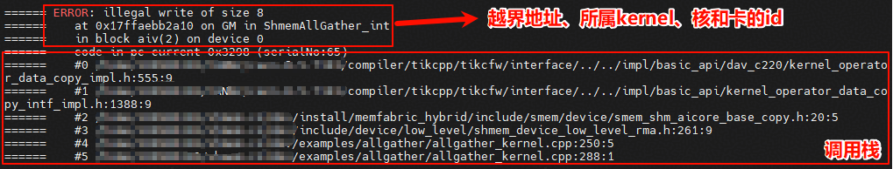

# SHMEM搭配工具算子调测指导

## msprof
shmem后续会适配[msprof算子调优工具](https://www.hiascend.com/document/detail/zh/mindstudio/830/ODtools/Operatordevelopmenttools/atlasopdev_16_0082.html)
当前版本暂不支持，预计Q1支持。

## mssanitizer
shmem已适配[mssanitizer内存检测工具](https://www.hiascend.com/document/detail/zh/mindstudio/830/ODtools/Operatordevelopmenttools/atlasopdev_16_0039.html)，以下功能的相关接口暂不支持该工具的使用：
- SDMA/RDMA/UDMA相关接口和用例不支持使用mssanitizer进行内存检测

**该功能依赖对应 CANN 版本能力，预计社区版 9.1.0 支持**

如果当前使用的 CANN 版本不支持 mssanitizer，可按以下步骤从源码安装：

### 一、安装 mssanitizer

参考：[mssanitizer 安装指南](https://gitcode.com/Ascend/mssanitizer/blob/master/docs/zh/install_guide/mssanitizer_install_guide.md)

获取源码并编译出包：

```sh
git clone https://gitcode.com/Ascend/mssanitizer.git
cd mssanitizer
python build.py
```

安装 run 包：

```sh
cd output
chmod +x mindstudio-sanitizer_*.run
./mindstudio-sanitizer_*.run --run
```

如果已设置 `ASCEND_HOME_PATH` 环境变量，安装至 `$ASCEND_HOME_PATH`；否则安装至默认路径 `$HOME/Ascend`。

### 二、安装 mstx

参考：[mstx 安装指南](https://gitcode.com/Ascend/mstx/blob/master/docs/zh/install_guide/mstx_install_guide.md)

安装编译依赖：

- openEuler / CentOS 环境：

```sh
yum install python3-devel
```

- Ubuntu 环境：

```sh
apt-get install python3-dev
```

获取 mstx 源码并安装 whl 包：

```sh
git clone https://gitcode.com/Ascend/mstx.git
cd mstx
cd output
pip3 install --upgrade mstx-xxxxx.whl --target ${ASCEND_HOME_PATH}/tools/mstx/
```


### 三、shmem 使能mssanitizer工具能力

在shmem/目录编译:
- Ascend910B/C 平台:
```sh
bash scripts/build.sh -mssanitizer
```
- Ascend950 平台:
```sh
bash scripts/build.sh -soc_type Ascend950 -mssanitizer
```

不同芯片型号的编译选项有所差异：
- **Ascend950**：内存检测所有功能不需要 `--cce-enable-sanitizer` 编译选项，编译时仅添加 `-g` 即可，mssanitizer 功能正常生效。
- **其他芯片型号（如 Ascend910B）**：编译时需添加 `-g --cce-enable-sanitizer` 编译选项以启用 mssanitizer 插桩。

当前构建脚本会根据 `SOC_TYPE` 自动选择对应的编译选项，无需手动配置。

工具默认开启内存检测能力，即--tool memcheck，一般情况按如下方式拉起可执行文件即可。
```sh
mssanitizer -- application parameter1 parameter2 ...
```
执行如下命令，可以在开启竞争检测前提下，额外开启卡间竞争检测功能：
```sh
mssanitizer --tool=racecheck --check-cross-npu-races=yes application
```
如果需要更详细的工具能力可参考[MindStudio Sanitizer 使用指南](https://gitcode.com/Ascend/mssanitizer/blob/master/docs/zh/user_guide/mssanitizer_user_guide.md)按如下格式控制参数
```sh
mssanitizer <options> -- <user_program> <user_options> 
```
### mssanitizer执行SHMEM自带的example样例

shmem的[AllGather](https://gitcode.com/cann/shmem/tree/master/examples/allgather)样例运行脚本提供了tool选项选择拉起工具。

编译样例且使能工具能力
- Ascend910B/C 平台:
```sh
bash scripts/build.sh -examples -mssanitizer
```
- Ascend950 平台:
```sh
bash scripts/build.sh -soc_type Ascend950 -examples -mssanitizer
```
用mssanitizer工具拉起allgather样例进行内存检测
```sh
cd examples/allgather
mssanitizer -- bash run.sh -pes 2
```
### 内存越界日志
当内存发生越界时工具会先打屏越界地址，越界内存大小、所属kernel，核号、卡号等信息。

随后打屏越界代码的调用栈。可以协助开发快速定位越界问题以及排查代码漏洞。



**注：`aclshmem_malloc`等shmem提供的内存分配接口是对已完成物理地址映射的一大块连续虚拟内存进行划分，不涉及实际的物理内存申请或虚拟内存对物理内存的映射操作。如使用的虚拟地址已完成和已分配物理地址的映射，即使超出`aclshmem_malloc`分配的范围也不会报错，因为该地址对应的内存可以合法使用。**

## profiling
shmem提供了Profiling打点工具，通过采集系统时钟周期数并转换为实际时间，精准量化不同Block（计算核）、不同Frame（埋点 ID）下的MTE搬运性能，详细介绍请参考[在示例中使用Profiling工具](profiling.md).
