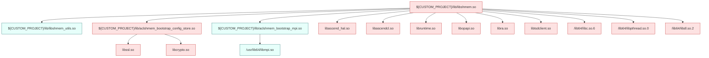

# **1. SO文件部署与使用指导**

## 1.1 概述
本指导面向Linux环境的开发与运维人员，说明项目SO文件部署、依赖关系、排查与验证方法。

### 1.1.1 部署原则
- 1）SO文件统一拷贝到用户项目自有目录（示例：`${CUSTOM_PROJECT}/lib/`）。
- 2）运行时从项目自有目录加载，不依赖系统公共目录。
- 3）bootstrap插件（`aclshmem_bootstrap_config_store.so`、`aclshmem_bootstrap_mpi.so`）在当前实现中优先按`aclshmem.so`同目录绝对路径加载，部署时需与`libshmem.so`放置在同一目录。
- 4）其他外部运行时SO（如CANN/OpenSSL相关）仍需满足其各自的安装与可见性要求。

## 1.2 必拷贝SO文件清单
| 文件名 | 功能说明 | 是否为核心依赖 |
|---|---|---|
| `libshmem.so` | SHMEM主功能库，提供对外核心接口 | 是 |
| `aclshmem_bootstrap_config_store.so` | 默认/UniqueID引导初始化能力 | 是 |
| `aclshmem_bootstrap_mpi.so` | MPI引导初始化能力（仅MPI场景） | 否 |
| `libshmem_utils.so`（如构建产物存在） | 公共工具与基础能力库 | 是 |

### 1.2.1 运行时动态加载的外部SO（需在目标环境可见）
| 文件名 | 来源 | 用途 |
|---|---|---|
| `libascend_hal.so` | CANN/驱动运行时 | HAL能力加载 |
| `libascendcl.so` | CANN Toolkit | ACL接口加载 |
| `libruntime.so` | CANN Toolkit | Runtime接口加载 |
| `libopapi.so` | CANN Toolkit | OP API接口加载 |
| `libra.so` | CANN通信组件 | HCCP相关能力 |
| `libtsdclient.so` | CANN通信组件 | TSD能力 |
| `libssl.so` | OpenSSL | TLS能力 |
| `libcrypto.so` | OpenSSL | 加密能力 |

说明：`libssl.so`与`libcrypto.so`由配置存储模块通过绝对路径动态加载，路径来源于`EP_OPENSSL_PATH`。

## 1.3 SO文件依赖关系（Linux）
### 1.3.1 依赖层级说明
- 强依赖：缺失后程序启动失败或核心能力不可用。
- 弱依赖：缺失后仅对应扩展能力不可用。

### 1.3.2 Mermaid依赖图（示例）


## 1.4 部署步骤（Linux）
### 1.4.1 步骤1：确认编译产物输出到`install/`
要求：`build.sh`输出目录必须为`install/`，不要使用历史默认输出目录。

Linux命令（CentOS/Ubuntu）：
```bash
# 在项目根目录执行
# Ascend910B/C 平台
bash scripts/build.sh install
# Ascend950 平台
bash scripts/build.sh -soc_type Ascend950 install

# 产物检查
ls -l install/lib/*.so
```

### 1.4.2 步骤2：拷贝SO到用户项目自有路径
Linux命令（CentOS/Ubuntu）：
```bash
# 变量按需替换
CUSTOM_PROJECT=/path/to/user_project
mkdir -p ${CUSTOM_PROJECT}/lib
cp -f install/lib/*.so ${CUSTOM_PROJECT}/lib/
chmod 755 ${CUSTOM_PROJECT}/lib/*.so
```

说明：按当前bootstrap加载逻辑，以上部署方式即可满足bootstrap插件加载。

### 1.4.3 推荐固定加载可见性（用户运行侧）
为避免多版本库共存导致的加载漂移，建议固定以下可见性策略：
- 1）将`libshmem.so`、`aclshmem_bootstrap_config_store.so`、`aclshmem_bootstrap_mpi.so`、`libshmem_utils.so`统一部署到`${CUSTOM_PROJECT}/lib/`。
- 2）业务程序优先从`${CUSTOM_PROJECT}/bin/`启动，确保主程序与目标库目录映射关系固定。
- 3）避免在系统公共目录保留同名旧版本SO，避免命中历史残留库。
- 4）问题排查时使用`LD_DEBUG=libs,files`确认实际加载路径，确保`aclshmem_bootstrap_config_store.so`来自与`libshmem.so`相同目录。

补充说明（两阶段加载逻辑）：
- 阶段A（动态链接阶段）：由系统动态链接器解析主程序与`libshmem.so`的`NEEDED`依赖，实际装载先后由链接关系决定，不作为接口语义约束。
- 阶段B（初始化阶段）：调用`aclshmemx_init_attr`后，`libshmem.so`内部按bootstrap模式选择并加载`aclshmem_bootstrap_config_store.so`或`aclshmem_bootstrap_mpi.so`。
- Python包场景：`src/python/shmem/__init__.py`存在导入阶段预加载行为，该行为仅用于Python封装侧依赖兜底，不能等同于`libshmem.so`初始化阶段的插件加载顺序语义。

## 1.5 编译产物路径配置（build.sh路径调整说明）
### 1.5.1 调整目标
将`build.sh`中SO输出目录调整为`install/`，替代旧默认路径（如`output/`）。

### 1.5.2 修改示例（可直接复制）
Linux示例：
```bash
# build.sh 片段（示例）
# 旧配置：DESTDIR=./output
# 新配置：DESTDIR=./install

DESTDIR=./install
INSTALL_LIB_DIR=${DESTDIR}/lib
mkdir -p "${INSTALL_LIB_DIR}"

# 示例：安装编译产物
cp -f ${BUILD_DIR}/lib/*.so "${INSTALL_LIB_DIR}/"
```

### 1.5.3 调整后执行命令
Linux命令（CentOS/Ubuntu）：
```bash
# Ascend910B/C 平台
bash scripts/build.sh install
# Ascend950 平台
bash scripts/build.sh -soc_type Ascend950 install
ls -l install/lib/
```

## 1.6 依赖排查方法（Linux）
### 1.6.1 使用`ldd`检查依赖项是否缺失
Linux命令：
```bash
ldd ${CUSTOM_PROJECT}/lib/libshmem.so
ldd ${CUSTOM_PROJECT}/lib/aclshmem_bootstrap_config_store.so
```

结果解读：
- 出现`not found`：依赖项缺失或路径错误。
- 全部解析到具体绝对路径：依赖关系正常。

### 1.6.2 使用`objdump`检查NEEDED条目
Linux命令：
```bash
objdump -p ${CUSTOM_PROJECT}/lib/libshmem.so | grep NEEDED
objdump -p ${CUSTOM_PROJECT}/lib/aclshmem_bootstrap_config_store.so | grep NEEDED
```

结果解读：
- `NEEDED`展示该SO实际依赖的动态链接库。
- 若关键依赖与部署清单不一致，需回溯构建配置或重新打包。

### 1.6.3 常见依赖问题与处置
- 1）依赖缺失：补齐缺失SO到`${CUSTOM_PROJECT}/lib/`并重新验证`ldd`。
- 2）版本不匹配：更换为与构建环境一致的SO版本并重测。
- 3）拷贝不完整：重新执行`cp -f install/lib/*.so ${CUSTOM_PROJECT}/lib/`。

## 1.7 验证方法（Linux）
### 1.7.1 文件与权限验证
```bash
ls -l ${CUSTOM_PROJECT}/lib/*.so
```
预期：目标SO齐全，权限为`-rwxr-xr-x`（755）或更高可读可执行权限。

### 1.7.2 依赖完整性验证
```bash
ldd ${CUSTOM_PROJECT}/lib/libshmem.so | grep -i "not found" && echo "依赖异常" || echo "依赖正常"
```
预期：输出`依赖正常`。

### 1.7.3 运行侧加载验证（示例）
```bash
# 以业务程序为例，替换为实际可执行文件
${CUSTOM_PROJECT}/bin/app --version
```
预期：程序正常启动，无SO加载失败日志。

### 1.7.4 加载路径一致性验证（推荐）
```bash
LD_DEBUG=libs,files ${CUSTOM_PROJECT}/bin/app --version 2>&1 | grep -E "libshmem.so|aclshmem_bootstrap_config_store.so"
```
预期：`aclshmem_bootstrap_config_store.so`与`libshmem.so`来自同一部署目录；插件在初始化阶段按bootstrap模式被正确加载。

## 1.8 常见问题FAQ
### 1.8.1 build.sh路径调整失败
问题：执行后产物仍输出到旧目录。

处理：
- 检查`build.sh`中是否仍存在旧变量（如`DESTDIR=./output`）。
- 确认路径覆盖顺序，避免后续逻辑再次改写`DESTDIR`。
- 清理旧目录后重编译：
```bash
rm -rf build output install
# Ascend910B/C 平台
bash scripts/build.sh install
# Ascend950 平台
bash scripts/build.sh -soc_type Ascend950 install
```

### 1.8.2 项目路径权限不足
问题：拷贝或运行时报`Permission denied`。

处理：
```bash
chmod -R u+rwX ${CUSTOM_PROJECT}/lib
chmod 755 ${CUSTOM_PROJECT}/lib/*.so
```
必要时由运维统一调整目录属主与属组。

### 1.8.3 Linux不同发行版SO兼容
问题：CentOS与Ubuntu间直接复用SO后加载失败。

处理：
- 建议在目标发行版上重新构建并重新部署`install/lib/*.so`。
- 保证glibc版本与编译基线一致。
- 使用`ldd`与`objdump -p`逐项核对依赖。
