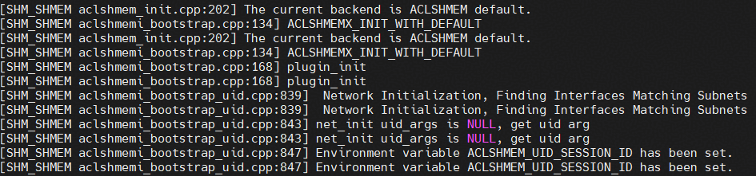
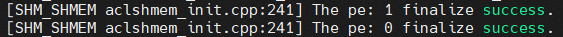

# SHMEM日志

## 环境变量介绍

SHMEM日志相关的几个环境变量：

* `ACLSHMEM_LOG_LEVEL`: 用于设置SHMEM日志等级，严重程度从高到低有TRACE、DEBUG、WARN、INFO、ERROR、FATAL。默认为ERROR，调试时建议设置为DEBUG或INFO。
* `ACLSHMEM_LOG_TO_STDOUT`: 用于设置SHMEM日志是否输出到控制台, 0: 关闭, 1: 开启输出到控制台。默认关闭，不输出到控制台，日志会存储到默认路径或指定路径。如果开启则会在控制台打印日志，日志将不再落盘到文件。
* `ACLSHMEM_LOG_PATH`: 用于设置SHMEM日志保存路径， 需要传递合法路径。如不设置默认存储路径为`${HOME}/aclshmem/log`。

## 日志阅读

每条SHMEM的日志一般会包含如下内容：时间、日志级别、进程号、日志模块、日志文件、日志所在行号、日志信息。

接下来通过一个初始化两个pe再去初始化的例子简单介绍如何看懂SHMEM日志。此样例日志都是info级别，主要关注日志信息。前面的，时间、日志级别、进程号等信息不做专门截取解释。
初始化阶段会先报出bootstrap使用的flag（如图中的ACLSHMEMX_INIT_WITH_DEFAULT）。然后会开始boostrap初始化，并检测环境变量的设置情况（如图中ACLSHMEM_UID_SESSION_ID未设置）。

SHMEM有一个root 0节点，在单机环境该节点可以使用回环地址，但在集群环境这样设置是错误的。因此初始化过程会报出当前的root 0（即remote address）是否是回环地址。如果是root 0是回环则默认单机环境，当前pe也可使用回环地址，当前pe的ip信息也会在netifaddr报出。

bootstrap过程中一般涉及多个socket的创建和使用，这些socket的信息也会在日志中体现，更详细的socket信息可以通过开启debug级别获取，但数量较大。

bootstrap成功后会有专门日志打印，同时日志里会标明pe号。

初始化成功后会有专门的日志打印，同时日志里会标明pe号。

去初始化成功后会有专门的日志打印，同时日志里会标明pe号。

SHMEM日志当前主要提供host侧的定位能力，device侧如算子发生报错时可能无法根据SHMEM定位，需配合CANN或者相关工具日志进行定位。