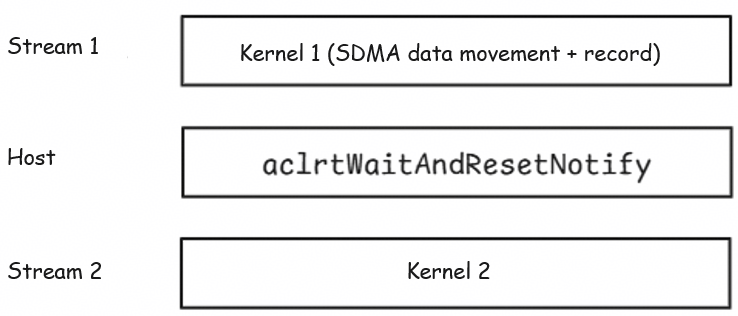

# NotifyWait Mechanism Usage Guide
## Environment Requirements and Preparations
The SDMA feature is newly supported in CANN 9.0.0 or later (trial version). You need to download and install the following CANN and OPS software packages first:
- Toolkit package ([CANN master OBP image website](https://mirror-centralrepo.devcloud.cn-north-4.huaweicloud.com/artifactory/cann-run-mirror/software/master/))
- ops-legacy package (Download a required version based on the hardware platform: [A2 x86_64](https://ascend-cann.obs.cn-north-4.myhuaweicloud.com/CANN/20260520_newest/cann-910b-ops-legacy_9.1.0_linux-x86_64.run)/[A2 aarch64](https://ascend-cann.obs.cn-north-4.myhuaweicloud.com/CANN/20260520_newest/cann-910b-ops-legacy_9.1.0_linux-aarch64.run)/[A3 x86_64](https://ascend-cann.obs.cn-north-4.myhuaweicloud.com/CANN/20260520_newest/cann-A3-ops-legacy_9.1.0_linux-x86_64.run)/[A3 aarch64](https://ascend-cann.obs.cn-north-4.myhuaweicloud.com/CANN/20260520_newest/cann-A3-ops-legacy_9.1.0_linux-aarch64.run))
## Example Execution Description
1. Build and install the software package in the `shmem/` directory:
```bash
bash scripts/build.sh -package
./install/*/SHMEM_1.0.0_linux-*.run --install
```

2. Build the examples in the `shmem/` directory:
```bash
bash scripts/build.sh -examples
```

3. Run the demo in the `shmem/examples/notifywait` directory:
```bash
bash run.sh -pes ${PES} -type ${TYPES}
````
- **Parameter description:**
    - PES: the number of devices (NPUs) used for running the demo; only 2, 4, or 8 cards are supported on one server
    - TYPES: type of the data to be transferred. Currently, the following data types are supported: int, uint8, int64, and fp32.

### Capacity and AIV Limits

- The example allocates `128M * sizeof(T)` bytes of symmetric memory. Input and result regions each require `PES * 8M * sizeof(T)` bytes. The documented support matrix is 2, 4, and 8 cards; actual use also depends on available symmetric-memory capacity.
- The SDMA shared workspace is 28 KiB. For the A5 maximum of 72 AIVs/QPs, notify IDs and three flag regions require `14 KiB + 72 * 4 B + 3 * 72 * 64 B = 28,448 B`, leaving 224 bytes, so the allocation is sufficient.
- The current kernel launches 20 blocks and uses 40 AIVs/QPs when there are two subblocks. The infrastructure and notify arrays now reserve up to 72 AIVs/QPs. Devices reporting more than 72 vector cores are currently rejected.
## NotifyWait Usage Description

### Example

```c++
//Step 1:
Kernel 1 on stream 1: Call the explicit-QP SDMA API to transfer data and call aclshmemx_sdma_qp_notify_record.
//Step 2:
Host: aclrtWaitAndResetNotify(notify_id, stream2, 0)
//Step 3:
Kernel 2 on stream 2: Use the data transferred via SDMA.

```

### Usage Description
In `aclshmemx_sdma_qp_notify_record`, a record-type SQE is issued to the selected STARS QP. The host then waits for the notify record to complete before continuing with subsequent kernels. Compared to `aclshmemx_sdma_qp_quiet`, which relies on AIV flag polling, this mechanism allows timely release of AIV resources.

## SDMA APIs Without an Explicit QP

Besides the explicit-QP APIs above, this example also demonstrates the SDMA APIs without a QP index. They have almost the same form, but always use QP 0 (no `qp_idx` parameter) and are single-core (single-AIV) APIs:

```c++
// Asynchronous transfer (always on QP 0)
template <typename T>
void aclshmemx_sdma_put_nbi(__gm__ T* dst, __gm__ T* src, __ubuf__ T* buf, uint32_t ub_size,
                            uint32_t elem_size, int pe, uint32_t sync_id);
// Append a notify record on QP 0; the host waits on notify_arr[0]
template <typename T>
void aclshmemx_sdma_notify_record(__ubuf__ T* buf, uint32_t ub_size, uint32_t sync_id);
```

The implementation is the `allgather_sdma_noqp` kernel in `main.cpp`: only AIV 0 executes, transfers this PE's data as one contiguous block (no per-AIV splitting is needed), and records a notify on QP 0:

```c++
// In the kernel (AIV 0 only)
aclshmemx_sdma_put_nbi(dst, src, tmp_buff, ub_size, size, pe, EVENT_ID0);
aclshmemx_sdma_notify_record(tmp_buff, ub_size, EVENT_ID0);

// On the host: wait for a single notify (QP 0 corresponds to notify_arr[0])
aclrtWaitAndResetNotify(g_state_host.notify_arr[0], stream, 0);
```

### Comparison With the Explicit-QP APIs

| Item | APIs without QP | Explicit-QP APIs |
| --- | --- | --- |
| QP used | Fixed QP 0 | Selected via qp_idx; all created QPs can be used |
| Execution | Single AIV | Multiple AIVs in parallel, one QP per AIV |
| Data splitting | Not needed; one contiguous transfer | Data must be split across AIVs |
| Host wait | notify_arr[0] only | One notify wait per QP |
| Use case | Simple single-core transfers, quick checks | Multi-core concurrency, bandwidth-sensitive scenarios |

When `run.sh` is executed, the demo first runs the multi-core allgather with explicit QPs and verifies it, then runs the single-core allgather without a QP and verifies it. The console prints both verification results (`after notify_wait` and `after sdma_put_nbi (no QP)`).
