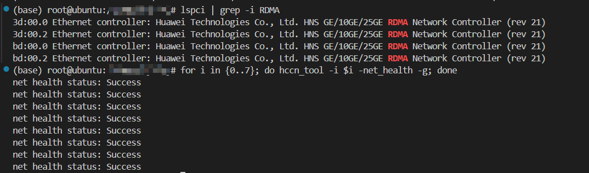

## 环境要求

- 运行本示例需要机器具备RDMA环境（RDMA网卡及驱动已正确安装配置）。

### 检查RDMA环境
```bash
lspci | grep -i RDMA
for i in {0..7}; do hccn_tool -i $i -net_health -g; done
```
可用环境命令输出如下：  


## 使用方式
1.在shmem/目录编译:
```bash
bash scripts/build.sh -enable_rdma -examples
```
2.在shmem/目录运行:
```bash
export PROJECT_ROOT=<shmem-root-directory>
export LD_LIBRARY_PATH=${PROJECT_ROOT}/build/lib:$LD_LIBRARY_PATH
export SHMEM_UID_SESSION_ID=127.0.0.1:8899
./build/bin/rdma_demo 2 0 tcp://127.0.0.1:8765 2 0 0 & # pe 0
./build/bin/rdma_demo 2 1 tcp://127.0.0.1:8765 2 0 0 & # pe 1
```
> 注：\<shmem-root-directory\>为SHMEM项目的根目录。

3.命令行参数说明
    ./rdma_demo <n_pes> <pe_id> <ipport> <g_npus> <f_pe> <f_npu>

- n_pes: 全局Pe数量。
- pe_id: 当前Pe号。
- ipport: SHMEM初始化需要的IP及端口号，格式为tcp://<IP>:<端口号>。如果执行跨机测试，需要将IP设为pe0所在Host的IP。
- g_npus: 当前卡上启动的NPU数量。
- f_pe: 当前卡上使用的第一个Pe号。
- f_npu: 当前卡上使用的第一个NPU卡号。