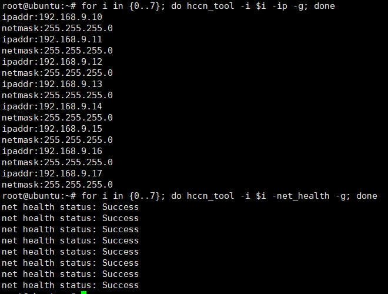
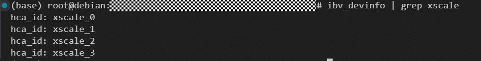

# Sample Introduction

## Environment Requirements

- Before running this example, ensure that the RDMA environment is available (the RDMA NIC and driver have been correctly installed and configured).

### Ascend950 CANN Version Requirement

RDMA examples on the Ascend950 platform require the **CANN 9.1.0** package. Other versions are not currently supported by these examples. Download the corresponding package from the [CANN 9.1.0 resources](https://www.hiascend.com/developer/download/community/result?module=cann&cann=9.1.0).

### Checking the RDMA Environment

#### A2/A3 Platforms

```bash
for i in {0..7}; do hccn_tool -i $i -ip -g; done
for i in {0..7}; do hccn_tool -i $i -net_health -g; done
```

Note: Change 7 based on the actual number of devices to be checked.

If the following command output is displayed, the environment is available:


#### Ascend950 Platform

Use the `ibv_devinfo` command to check the RDMA device information.

XSCALE NIC:

```bash
ibv_devinfo | grep xscale
```



HNS 1825 NIC:

```bash
ibv_devinfo | grep hrn
```


> Note: When the HNS 1825 NIC communicates over the same port, if port bridge is not enabled on the switch, RDMA may fail to send and receive data. For the port bridge configuration, see [FAQs - Port Bridge Configuration](../../docs/debug/Troubleshooting_FAQs.md#同端口通信需开启端口桥).

### IBV_EXTEND_DRIVERS Environment Variable

Before running on the Ascend950 platform, set the `IBV_EXTEND_DRIVERS` environment variable to the plugin library of the corresponding NIC:

- **XSCALE NIC**:

  ```bash
  export IBV_EXTEND_DRIVERS=<path_to_libxscale_nda.so>
  ```

- **HNS 1825 NIC**:

  ```bash
  export IBV_EXTEND_DRIVERS=<path_to_libhrn5-rdmav34.so>
  ```

  > Note: `libxscale_nda.so` and `libhrn5-rdmav34.so` are user-mode RDMA Verbs provider libraries of the corresponding NICs. **They are provided by the NIC driver installation packages, not by the SHMEM project build.** `libxscale_nda.so` is installed with the XSCALE NIC driver, and `libhrn5-rdmav34.so` is installed with the HNS 1825 NIC driver. After the NIC driver is installed, run `find / -name "libhrn5-rdmav34.so"` or `find / -name "libxscale_nda.so"` to locate the library path, and set the path as the value of `IBV_EXTEND_DRIVERS`. `IBV_EXTEND_DRIVERS` is a libibverbs environment variable used to load Verbs provider plugin libraries outside the default search path.

## Instructions

### Build

Run the following commands in the `shmem/` directory to build the example (for the complete RDMA backend parameter description, see [Compilation and Build - RDMA Parameters](../../docs/compilation_build_guide_en.md#rdma-parameters)):

- A2/A3 platforms:

```bash
bash scripts/build.sh -enable_rdma -examples
```

- Ascend950 platform (XSCALE NIC):

```bash
bash scripts/build.sh -soc_type Ascend950 -enable_rdma -rdma_backend XSCALE -examples
```

- Ascend950 platform (HNS 1825 NIC):

```bash
bash scripts/build.sh -soc_type Ascend950 -enable_rdma -rdma_backend HNS_1825 -examples
```

### Run

#### Method 1: Run `bash run.sh` in the `examples/rdma_demo` directory

- Run the example using the `run.sh` script.

    `run.sh` supports the `-pes` parameter to specify the number of PEs to start. The default value is 2.

    ```bash
    bash run.sh -pes 4
    ```

    > Note: On the Ascend950 platform, the `IBV_EXTEND_DRIVERS` environment variable must be set. See [Environment Variable Description](#ibv_extend_drivers-environment-variable).

#### Method 2: Run commands manually in the `shmem/` directory

- Commands for single-server dual-device execution:

    ```bash
    export PROJECT_ROOT=<shmem-root-directory>
    export IBV_EXTEND_DRIVERS=<path_to_plugin.so>  # Required only on the Ascend950 platform. Set this based on the NIC type. See the environment variable description.
    export LD_LIBRARY_PATH=${PROJECT_ROOT}/build/lib:$LD_LIBRARY_PATH
    ./build/bin/rdma_demo 2 0 tcp://127.0.0.1:8765 2 0 0 & # PE 0
    ./build/bin/rdma_demo 2 1 tcp://127.0.0.1:8765 2 0 0 & # PE 1
    ```

    > Note: \<shmem-root-directory\> indicates the root directory of the SHMEM project.
- Commands for cross-server dual-device execution:

    Assume that the IP address of server A is `ip1` and that of server B is `ip2`.
    Run the following commands on server A:

    ```bash
    export PROJECT_ROOT=<shmem-root-directory>
    export IBV_EXTEND_DRIVERS=<path_to_plugin.so>  # Required only on the Ascend950 platform. Set this based on the NIC type. See the environment variable description.
    export LD_LIBRARY_PATH=${PROJECT_ROOT}/build/lib:$LD_LIBRARY_PATH
    ./build/bin/rdma_demo 2 0 tcp://ip1:8765 1 0 0 # PE 0
    ```

    At the same time, run the following commands on server B:

    ```bash
    export PROJECT_ROOT=<shmem-root-directory>
    export IBV_EXTEND_DRIVERS=<path_to_plugin.so>  # Required only on the Ascend950 platform. Set this based on the NIC type. See the environment variable description.
    export LD_LIBRARY_PATH=${PROJECT_ROOT}/build/lib:$LD_LIBRARY_PATH
    ./build/bin/rdma_demo 2 1 tcp://ip1:8765 1 1 0 # PE 1
    ```

    > Note: \<shmem-root-directory\> indicates the root directory of the SHMEM project, and \<path_to_plugin.so\> indicates the plugin library path set based on the NIC type.
    >
    > To run a cross-server test in a container, specify the `--net=host` mode when starting the container.

#### Command Line Parameters

```bash
./rdma_demo <n_pes> <pe_id> <ipport> <g_npus> <f_pe> <f_npu>
```

- n_pes: number of global PEs.
- pe_id: PE ID of the current process.
- ipport: IP address and port number required for SHMEM initialization, in the format `tcp://<IP_address>:<port_number>`. To perform a cross-server test, set the IP address to the IP address of the host where PE0 is located.
- g_npus: number of NPUs started on the current server.
- f_pe: ID of the first PE used on the current server.
- f_npu: ID of the first NPU used to run this sample on the current server.
