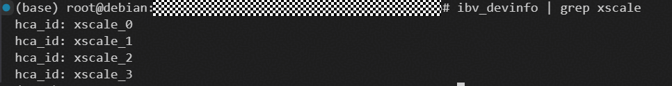

## 示例场景

本示例演示通过 RDMA RoCE 传输通路，使用低阶接口 `aclshmemx_roce_put_nbi` 配合同步/栅栏原语完成多 PE 之间的全交换（all-gather）数据通信，并验证数据正确性。

具体包含以下 8 种同步模式：
- **sync_all**：使用 `aclshmemx_roce_put_nbi` + `aclshmemx_roce_quiet` + `aclshmemx_roce_sync_all` 完成全局同步
- **sync_all_buf**：使用 `aclshmemx_roce_put_nbi` + `aclshmemx_roce_quiet` + `aclshmemx_roce_sync_all(buf, sync_id)` 显式传入 UB buffer 和 sync_id
- **barrier_all**：使用 `aclshmemx_roce_put_nbi` + `aclshmemx_roce_barrier_all` 完成全局同步（barrier 内部自动 quiet）
- **barrier_all_buf**：使用 `aclshmemx_roce_put_nbi` + `aclshmemx_roce_barrier_all(buf, sync_id)` 显式传入 UB buffer 和 sync_id
- **sync_team**：使用 `aclshmemx_roce_put_nbi` + `aclshmemx_roce_quiet` + `aclshmemx_roce_team_sync(team)` 在 team 内完成同步
- **sync_team_buf**：使用 `aclshmemx_roce_put_nbi` + `aclshmemx_roce_quiet` + `aclshmemx_roce_team_sync(team, buf, sync_id)` 在 team 内显式传入参数
- **barrier_team**：使用 `aclshmemx_roce_put_nbi` + `aclshmemx_roce_barrier(team)` 在 team 内完成同步
- **barrier_team_buf**：使用 `aclshmemx_roce_put_nbi` + `aclshmemx_roce_barrier(team, buf, sync_id)` 显式传入参数

## 环境要求

运行本示例需要机器具备 RDMA 环境（RDMA 网卡及驱动已正确安装配置）。

### 检查 RDMA 环境

#### Ascend910B/C 平台

```bash
for i in {0..7}; do hccn_tool -i $i -ip -g; done
for i in {0..7}; do hccn_tool -i $i -net_health -g; done
```

> 注：7 需要根据实际要查看的卡数修改。

可用环境命令输出如下：


#### Ascend950 平台

使用 `ibv_devinfo` 命令检查 RDMA 设备信息。

```bash
ibv_devinfo | grep xscale
```

可用环境命令输出如下：



## 使用方式

### 编译

在 `shmem/` 目录执行以下命令进行编译：

- Ascend910B/C 平台：

```bash
bash scripts/build.sh -enable_rdma -examples
```

- Ascend950 平台：

```bash
bash scripts/build.sh -soc_type Ascend950 -enable_rdma -rdma_backend XSCALE -examples
```

### 运行

#### 方式一：在 `examples/rdma_sync_barrier_demo` 目录下执行 `bash run.sh`

`run.sh` 支持通过参数指定 demo 类型，默认为 `sync_all`。

```bash
bash run.sh sync_all           # 运行 sync_all demo（默认）
bash run.sh sync_all_buf       # 运行 sync_all(buf, sync_id) demo
bash run.sh barrier_all        # 运行 barrier_all demo
bash run.sh barrier_all_buf    # 运行 barrier_all(buf, sync_id) demo
bash run.sh sync_team          # 运行 sync_team demo
bash run.sh sync_team_buf      # 运行 sync_team(buf, sync_id) demo
bash run.sh barrier_team       # 运行 barrier_team demo
bash run.sh barrier_team_buf   # 运行 barrier_team(buf, sync_id) demo
```

> 注：Ascend950 平台需要在 `run.sh` 中设置 `IBV_EXTEND_DRIVERS` 环境变量：
> ```bash
> export IBV_EXTEND_DRIVERS=<path_to_libxscale_nda.so>
> ```

#### 方式二：在 `shmem/` 目录手动运行命令

- 单机 2 卡执行命令

```bash
export PROJECT_ROOT=<shmem-root-directory>
export IBV_EXTEND_DRIVERS=<path_to_libxscale_nda.so> # 仅 Ascend950 平台需要
export LD_LIBRARY_PATH=${PROJECT_ROOT}/build/lib:$LD_LIBRARY_PATH
./build/bin/rdma_sync_barrier_demo 2 0 tcp://127.0.0.1:8899 2 0 0 sync_all & # PE 0
./build/bin/rdma_sync_barrier_demo 2 1 tcp://127.0.0.1:8899 2 0 0 sync_all & # PE 1
```

> 注：\<shmem-root-directory\> 为 SHMEM 项目的根目录。

- 跨机 2 卡执行命令

假设机器 A 的 IP 为 ip1，机器 B 的 IP 为 ip2。
在机器 A 执行如下命令：

```bash
export PROJECT_ROOT=<shmem-root-directory>
export IBV_EXTEND_DRIVERS=<path_to_libxscale_nda.so> # 仅 Ascend950 平台需要
export LD_LIBRARY_PATH=${PROJECT_ROOT}/build/lib:$LD_LIBRARY_PATH
./build/bin/rdma_sync_barrier_demo 2 0 tcp://ip1:8765 1 0 0 sync_all # PE 0
```

同时，在机器 B 执行如下命令：

```bash
export PROJECT_ROOT=<shmem-root-directory>
export IBV_EXTEND_DRIVERS=<path_to_libxscale_nda.so> # 仅 Ascend950 平台需要
export LD_LIBRARY_PATH=${PROJECT_ROOT}/build/lib:$LD_LIBRARY_PATH
./build/bin/rdma_sync_barrier_demo 2 1 tcp://ip1:8765 1 1 0 sync_all # PE 1
```

> 注：\<shmem-root-directory\> 为 SHMEM 项目的根目录。
>
> 如需在容器中运行跨机测试，启动容器时指定 `--net=host` 模式即可。

- 双机 16 卡（每机 8 卡）执行命令示例

假设机器 A 的 IP 为 ip1，机器 B 的 IP 为 ip2。
在机器 A 执行如下命令：

```bash
export PROJECT_ROOT=<shmem-root-directory>
export LD_LIBRARY_PATH=${PROJECT_ROOT}/build/lib:$LD_LIBRARY_PATH
pids=()
for pe in $(seq 0 7); do
    ./build/bin/rdma_sync_barrier_demo 16 $pe tcp://ip1:8765 8 0 0 sync_all &
    pids+=($!)
done
for pid in ${pids[@]}; do wait $pid; done
```

在机器 B 执行如下命令：

```bash
export PROJECT_ROOT=<shmem-root-directory>
export LD_LIBRARY_PATH=${PROJECT_ROOT}/build/lib:$LD_LIBRARY_PATH
pids=()
for pe in $(seq 8 15); do
    ./build/bin/rdma_sync_barrier_demo 16 $pe tcp://ip1:8765 8 8 0 sync_all &
    pids+=($!)
done
for pid in ${pids[@]}; do wait $pid; done
```

### 命令行参数说明

```bash
./rdma_sync_barrier_demo <n_pes> <pe_id> <ipport> <g_npus> <f_pe> <f_npu> [demo_type]
```

| 参数 | 说明 |
|------|------|
| n_pes | 全局 PE 数量 |
| pe_id | 当前进程的 PE 号 |
| ipport | SHMEM 初始化需要的 IP 及端口号，格式为 `tcp://<IP>:<端口号>`。若执行跨机测试，需将 IP 设为 PE 0 所在 Host 的 IP |
| g_npus | 当前机器上启动的 NPU 卡数量 |
| f_pe | 当前机器上使用的第一个 PE 号 |
| f_npu | 当前机器执行本样例使用的第一张 NPU 卡的卡号 |
| demo_type | 可选，指定 demo 类型，默认为 `sync_all`。支持的值见下方表格 |

**demo_type 取值：**

| 值 | 说明 |
|------|------|
| `sync_all` | 使用 `aclshmemx_roce_sync_all` 完成全局同步 |
| `sync_all_buf` | 使用 `aclshmemx_roce_sync_all(buf, sync_id)` 完成全局同步 |
| `barrier_all` | 使用 `aclshmemx_roce_barrier_all` 完成全局同步 |
| `barrier_all_buf` | 使用 `aclshmemx_roce_barrier_all(buf, sync_id)` 完成全局同步 |
| `sync_team` | 使用 `aclshmemx_roce_team_sync(team)` 在 team 内完成同步 |
| `sync_team_buf` | 使用 `aclshmemx_roce_team_sync(team, buf, sync_id)` 在 team 内完成同步 |
| `barrier_team` | 使用 `aclshmemx_roce_barrier(team)` 在 team 内完成同步 |
| `barrier_team_buf` | 使用 `aclshmemx_roce_barrier(team, buf, sync_id)` 在 team 内完成同步 |

### 预期输出

每个 PE 向所有其他 PE 发送自己的数据（值为 `pe_id + 10`），同步完成后各 PE 校验收到的数据是否正确。校验通过后输出：

```
[PASS] check success, pe=<pe_id>
```

若校验失败，会打印具体的不匹配信息：

```
[FAIL] pe=<pe_id> offset=<offset> got=<actual> expected=<expected>
```
