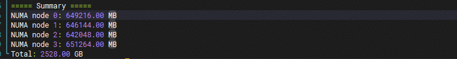

## 概述

本样例基于 SHMEM 工程，介绍了 put & get scalar 数据传输接口访问 Host 内存的使用。

## 支持的产品型号

- Atlas A3 训练系列产品/Atlas A3 推理系列产品

## 样例实现

本样例呈现的是 SHMEM 的 put & get scalar 数据传输接口的使用流程，以下简称 put & get 接口。

### 测试用例实现

（1）初始化 [ACL](https://www.hiascend.com/document/detail/zh/CANNCommunityEdition/83RC1alpha003/API/appdevgapi/aclcppdevg_03_1945.html) 和 [SHMEM](../../README.md)，分配 input 和 output 数据内存大小并初始化数据，input 初始化数据为 0，output 数据为当前 my_pe，后续 put 接口会把本 PE 的 PE 编号发送给下一个 PE 的 input，get 接口会获取下一个 PE 的 output。

（2）调用 run_demo_scalar 启动内核，执行对应 kernel 实现，前后调用 aclshmem_barrier 插入同步确保内核执行不受影响。

（3）执行结果校验，判断各个 PE 上的结果是否符合预期。

（4）清理释放 SHMEM 和 ACL 相关资源。

### Kernel 实现

（1）kernel 侧获取本 PE 编号、总 PE 数量、目标 PE 编号。

（2）调用 aclshmem_int32_p 接口向下一个 PE 的 input 发送本 PE 的 PE 编号，调用 aclshmem_quiet 插入同步等待 scalar 数据发送完成。

（3）调用 aclshmem_int32_g 获取下一个 PE 的 output 数据，调用 aclshmem_quiet 插入同步等待 scalar 数据接收完成，并将数据填入本 PE 的 output。

## 编译执行

环境配置请参考[快速上手](../../docs/quickstart.md)。完成环境配置后，执行如下命令可进行功能验证。

```bash
# 执行编译
bash scripts/build.sh -examples -cann
cd examples/rma_d2h_demo
# 运行用例
bash run.sh
```

用例执行完成，打屏信息出现“[INFO] demo run end in pe <my_pe>”，说明样例执行结束；打屏信息出现“[SUCCESS] run success in pe <my_pe>”，说明样例执行成功且结果准确。

## 约束限制

### 查询A3超节点可用内存大小

运行[check_support.py](./check_support.py)脚本扫描可用的物理内存：

```bash
python3 check_support.py
```



样例当前默认配置 1GB Host 内存大小，查询的总的可用内存需要大于 1GB。

### A3 超节点 Server ID 配置要求

本样例在 A3 超节点环境下运行时，需要确保各服务器的 Server ID 配置正确。特别是在更换故障硬件后，可能出现 Server ID 未正确配置的情况，会导致样例运行失败。

#### 查询 Server ID 方法

使用 npu-smi 工具查询当前服务器的 Server ID 配置：

```bash
npu-smi info -t spod-info -i 0 -c 0
```

输出示例：

```bash
SDID : 16777216
Super Pod Size : 384
Super Pod ID : 0
Server Index : 4
```

其中 `Server Index` 即为当前服务器的 Server ID，需要确保一个计算节点内所有NPU保持一致。

#### 配置 Server ID 方法

如果发现 Server ID 配置不正确，可以通过以下方式修改：

1. **通过 Redfish 接口修改**
   - 参考文档：[Redfish 接口修改文档](https://support.huawei.com/enterprise/zh/doc/EDOC1100401665/1f8efb4e?idPath=23710424|251366513|22892968|252309113|261207247)

2. **通过 Computing Toolkit 修改**
   - 参考文档：[Computing Toolkit 修改文档](https://support.huawei.com/enterprise/zh/doc/EDOC1100526238/df7e6eda?idPath=23710424|251366513|22892968|252309113|258915853)